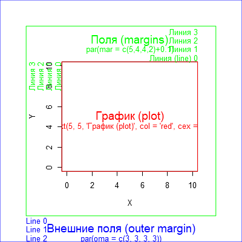

Ключевые слова: R[^1], r-project, RStudio  

Примеры выполнены R версии `r paste0(R.version$major, '.', R.version$minor)`, "`r R.version$nickname`".  

Версия RStudio: 1.4.1103.  

Все ссылки действительны на 02 марта 2021 г.  

Файл с макетом кода для этой практики: [lab_2-3-2021_before.R](https://sites.google.com/a/kiber-guu.ru/r-practice/dpv/lab_2-3-2021_before.R?attredirects=0&d=1)  

```{r setup, include = F}
knitr::opts_chunk$set(
    echo = T,
    comment = "#>",
    collapse = T,
    fig.align = 'center'
    # fig.height = 4,
    # fig.width = 4
)

# пакеты
library('Cairo')

# функция для форматирования чисел в тексте (2 знака после запятой)
comma <- function(x) {
    format(x, nsmall = 2, digits = 2, big.mark = ' ', decimal.mark = ',')
}

# размеры графиков
png.width <- 400
png.height <- 400
```

##### Новая страница    

## Графические системы в R      

\ \ \ \ \ R предоставляет пользователю широкие графические возможности. Если говорить о визуализации количественных данных, то на данный момент в R существуют три основных графических системы, которые принципиально отличаются друг от друга [^2]:  

1. **Встроенная система «base»** [^3]. Построена по принципу конструктора: различные функции вызываются последовательно и дополняют график. При этом обязательно использование одной базовой функции, которая определяет тип графика и данные и создаёт область графика. Такими основными функциями являются, например, `plot()`, `boxplot()`, `curve()`.  

1. **Система «trellis»**, реализованная в пакете **«lattice»** [^4]. Была создана специально для изображения кросс-секционных данных и направлена в основном на создание графиков по категориям значений. В отличие от «base», подавляющее большинство графиков «lattice» строится вызовом одной функции, и после создания графика его сложно изменить, например, добавив подписи осей, и нельзя дополнить новой порцией точек или кривых. С другой стороны, графические параметры в «lattice» настроены заранее и оптимизированы для представления нескольких графиков на одной панели.   

3.	**Система «ggplot»** (пакет **«ggplot2»** [^5]). Реализует грамматику графиков, предложенную Леландом Уилкинсоном. График собирается как «предложение» из нескольких функций, первая из которых задаёт исходные данные («существительное»), вторая -- их представление («глагол»), остальные добавляют на график дополнительные слои («прилагательные»). Как и в «lattice», система автоматически управляет графическими параметрами. Также функции «ggplot2» могут трансформировать данные (например, шкалы показателей) и изменять их под различные координатные системы.   

\ \ \ \ \ Функции трёх графических систем не сочетаются друг с другом. Поэтому прежде чем строить график, стоит понять, какие принципы изображения необходимы в данном случае:     

1.	На начальной, разведочной, стадии анализа, для представления данных, не сгруппированных по категориям, подходит «base».  

1.	Система «lattice» поможет представить данные с переменными-факторами, представив графики по категориям на отдельных панелях.  

1.	Система «ggplot2» построит более сложные визуализации, например, с пересчётом в другие координаты; нанесёт данные на географическую карту; сохранит график со всеми настройками в виде отдельного объекта в рабочем пространстве R.  
\ \ \ \ \ В R существует много готовых функций на базе перечисленных пакетов, которые служат для создания специальных графиков. Некоторые из них:   

* мозаичные графики и графики ассоциаций для визуализации категориальных данных: пакет «vcd» [^6];   

* самоорганизующиеся карты Кохонена: пакет «kohonen» [^7];   

* «тепловые карты» для визуализации схожести объектов и результатов кластерного анализа: пакет «gplots» [^8];   

* интерактивные трёхмерные графики: пакет «rgl» [^9];   

* фазовые плоскости одно- и двумерных автономных систем дифференциальных уравнений: пакет «phaseR» [^10].   

\ \ \ \ \ Рассмотрим работу с графическими системами «base», «lattice» и «ggplot2» на примерах.


### Пакет `base`   

\ \ \ \ \ **Пример №1.** Для работы с «base» включать дополнительные пакеты не требуется. Воспользуемся встроенным набором данных по качеству воздуха в Нью-Йорке `airquality`.   

```{r paragraph-01-chunk-01-hidden, include = F}
# Загрузка пакетов
library('data.table') # работаем с объектами "таблица данных"

# копируем в таблицу данных
DT.air <- data.table(airquality)
```

```{r paragraph-01-chunk-01, eval = F}
# Загрузка пакетов
library('data.table') # работаем с объектами "таблица данных"

# встроенный набор: загрязнённость воздуха в Нью-Ньорке
? airquality

# копируем в таблицу данных
DT.air <- data.table(airquality)
```

\ \ \ \ \ Чтобы построить график разброса содержания озона в воздухе (столбец `Ozone`) от силы ветра (столбец `Wind`), воспользуемся базовой функцией `plot()`. У неё всего два обязательных аргумента: координаты по `x` и по `y`.   
```{r paragraph-01-chunk-02-hidden, include = F}
Cairo('./plots/plot-01.png', width = png.width, height = png.height)
plot(x = DT.air$Ozone, y = DT.air$Wind)              # Рис. 1
dev.off()
```

```{r paragraph-01-chunk-02, eval = F}
# простой график разброса
plot(x = DT.air$Ozone, y = DT.air$Wind)              # Рис. 1
```


\ \ \ \ \ Построим график, на котором точки, соответствующие разным месяцам, будут отличаться по цвету. Также добавим подписи осей, легенду и заголовок. Сделаем так, чтобы оси пересекались в точке (0, 0) и заканчивались стрелками. Всё это потребует последовательности команд.   

\ \ \ \ \ Начнём с подготовки факторной переменной для обозначения каждого месяца своим цветом. Создадим вектор `mnth.f`, в который запишем все уникальные значения столбца таблицы данных с номером месяца (`unique(DT.air$Month)`), преобразованные в фактор функцией `as.factor()`. Вектор `mnth.f` понадобится нам для легенды графика.   

\ \ \ \ \ Данные охватывают пять месяцев. Создадим вектор `cls`, в который запишем пять цветов из встроенной палитры «радуга» (функция `rainbow()`).   

```{r paragraph-01-chunk-03}
# сколько месяцев в данных?
unique(DT.air$Month)

# цвет по месяцам для легенды графика
mnth.f <- as.factor(unique(DT.air$Month))

# берём палитру на 5 цветов
cls <- palette(rainbow(5))
# результат
cls
```

\ \ \ \ \ Теперь построим график разброса в несколько шагов. Сначала используем функцию `plot()` с аргументами:    
* `x`, `y` -- координаты.   

* `pch` -- тип маркера. Значение «21» задаёт круг, который можно залить цветом.   

* `bg` -- цвет заливки маркера. Мы задаём свой цвет для каждого наблюдения, в зависимости от того, какому месяцу соответствует точка. Команда `cls[as.factor(DT.air$Month)]` означает, что вектор с цветами палитры `cls` будет «растянут» до длины вектора-столбца DT.air$Month, и каждому уникальному значению месяца будет соответствовать один из пяти цветов палитры.   

* `axes = F` -- запрещает рисовать оси и границы области графика. Оси мы достроим позже.   

* `ylim` и `xlim` -- наименьшее и наибольшее значения по каждой из осей. Значения взяты с опорой на график на Рис. 1.   

* `xlab`, `ylab` -- подписи осей.

```{r paragraph-01-chunk-04, eval = F}
# создаём график без осей
plot(x = DT.air$Ozone, y = DT.air$Wind, 
     pch = 21, bg = cls[as.factor(DT.air$Month)],
     axes = F, ylim = c(0, 25), xlim = c(0, 180), 
     xlab = 'Озон в воздухе, частиц на миллиард', 
     ylab = 'Сила ветра, м/час')
```

\ \ \ \ \ Добавим оси с помощью функций `axis()`. Аргументы этой функции:   

* `side` -- сторона графика, по которой отложена ось. Значение «1» соответствует нижней границе графика (горизонтальная ось), «2» -- левой границе (вертикальная ось). Также можно нарисовать ось по верхней (сторона «3») и по правой границе графика («4»).   

* `pos` -- точка пересечения с другой осью. Мы хотим, чтобы оси пересекались в точке (0, 0).   

* `at` -- деления оси.   

* `labels` -- подписи делений оси. Для вертикальной оси мы пропускаем подпись при нуле, т.к. ноль уже подписан по горизонтали.   

* `las` -- параметр, который отвечает за ориентацию подписей делений. По умолчанию подписи перпендикулярны оси. Для вертикальной оси мы разворачиваем их параллельно нижнему краю графика, задав `las = 2`.   

\ \ \ \ \ Стрелки на концах осей нарисуем функцией `arrows()`, задав четыре вектора: `x0`, `y0` -- координаты начал стрелок по горизонтали и по вертикали, `x1` и `y1` -- координаты концов стрелок.   

```{r paragraph-01-chunk-05, eval = F}
# горизонтальная ось 
axis(side = 1, pos = 0, at = seq(0, 150, by = 50),
     labels = seq(0, 150, by = 50))
# вертикальная ось
axis(side = 2, pos = 0, at = seq(0, 20, by = 5),
     labels = c('', seq(5, 20, by = 5)),
     las = 2)
# стрелки на концах осей
arrows(x0 = c(0, 150), y0 = c(20, 0),
       x1 = c(0, 180), y1 = c(25, 0))
```

\ \ \ \ \ Добавим легенду и заголовки. Аргументы функции `legend()`:   

* `'topright'` -- ключевое слово, которое задаёт расположение легенды на графике: вверху справа.   

* `legend` -- подписи легенды.   

* `fill` -- цвета заливки позиций легенды.   

\ \ \ \ \ Для заголовков используем универсальную функцию `mtext()`, которая подходит для создания подписей с любого края графика, с аргументами:    

* `text` -- текст заголовка.    

* `side` -- сторона, по которой расположить текст. Значения те же, что у одноимённого аргумента в функции `axis()`.    

* `line` -- линия текста. Значение «0» соответствует подписи по самой границе графика, «1» -- с отступом в одну линию, «2» -- с отступом в две линии текста, и т.д.   

* `cex` -- масштаб текста. Значения меньше 1 уменьшают шрифт, больше 1 -- растягивают.    

* `font` -- начертание шрифта. Значение «1» -- обычное начертание, «2» -- полужирный шрифт, «3» -- курсив.   

```{r paragraph-01-chunk-06-hidden, include = F}
Cairo('./plots/plot-02.png', width = png.width, height = png.height)

# создаём график без осей
plot(x = DT.air$Ozone, y = DT.air$Wind, 
     pch = 21, bg = cls[as.factor(DT.air$Month)],
     axes = F, ylim = c(0, 25), xlim = c(0, 180), 
     xlab = 'Озон в воздухе, частиц на миллиард', 
     ylab = 'Сила ветра, м/час')

# горизонтальная ось 
axis(side = 1, pos = 0, at = seq(0, 150, by = 50),
     labels = seq(0, 150, by = 50))
# вертикальная ось
axis(side = 2, pos = 0, at = seq(0, 20, by = 5),
     labels = c('', seq(5, 20, by = 5)),
     las = 2)
# стрелки на концах осей
arrows(x0 = c(0, 150), y0 = c(20, 0),
       x1 = c(0, 180), y1 = c(25, 0))

# легенда
legend('topright', legend = mnth.f, fill = cls[mnth.f])
# заголовок
mtext(text = 'Разброс значений по месяцам', side = 3, 
      line = 2, font = 2)
mtext(text = '(в легенде указан номер месяца)', side = 3, 
      line = 1, cex = 0.8, font = 3)                 # Рис. 2

dev.off()
```

```{r paragraph-01-chunk-06, eval = F}
# легенда
legend('topright', legend = mnth.f, fill = cls[mnth.f])
# заголовок
mtext(text = 'Разброс значений по месяцам', side = 3, 
      line = 2, font = 2)
mtext(text = '(в легенде указан номер месяца)', side = 3, 
      line = 1, cex = 0.8, font = 3)                 # Рис. 2
```


\ \ \ \ \ В рамках того же примера построим коробчатые диаграммы содержания озона в воздухе по месяцам. Базовой функцией здесь будет `boxplot()`, и мы используем формулу, чтобы задать переменные.   

\ \ \ \ \ Формула `DT.air$Ozone ~ as.factor(DT.air$Month)` означает, что столбец `Ozone` таблицы `DT.air` зависит от столбца `Month`. Содержание озона будет отложено по вертикальной оси, а номер месяца -- по горизонтальной. По горизонтали на этом графике откладываются категориальные переменные, поэтому мы превращаем столбец `Month` в фактор.   

```{r paragraph-01-chunk-07-hidden, include = F}
Cairo('./plots/plot-03.png', width = png.width, height = png.height)
# ящики с усами по месяцам
boxplot(DT.air$Ozone ~ as.factor(DT.air$Month), 
        xlab = 'Номер месяца', 
        ylab = 'Озон в воздухе, частиц на миллиард') # Рис. 3
dev.off()
```

```{r paragraph-01-chunk-07, eval = F}
# ящики с усами по месяцам
boxplot(DT.air$Ozone ~ as.factor(DT.air$Month), 
        xlab = 'Номер месяца', 
        ylab = 'Озон в воздухе, частиц на миллиард') # Рис. 3
```


\ \ \ \ \ Последний пример на тех же данных -- кривая плотности распределения переменной «содержание озона в воздухе» [^11]. Результат показан на Рис. 4.   

```{r paragraph-01-chunk-08-hidden, include = F}
Cairo('./plots/plot-04.png', width = png.width, height = png.height)

# график плотности распределения
d <- density(DT.air$Ozone, na.rm = T)
plot(d, 
     main = 'Плотность распределения показателя \n "Содержание озона в воздухе"',
     ylab = 'Плотность')
polygon(d, col = rgb(1, 0, 0, alpha = 0.4), 
        border = 'red')                              # Рис. 4

dev.off()

# удаляем временные объекты
rm(cls, d, mnth.f)
```

```{r paragraph-01-chunk-08, eval = F}
# график плотности распределения
d <- density(DT.air$Ozone, na.rm = T)
plot(d, 
     main = 'Плотность распределения показателя \n "Содержание озона в воздухе"',
     ylab = 'Плотность')
polygon(d, col = rgb(1, 0, 0, alpha = 0.4), 
        border = 'red')                              # Рис. 4

# удаляем временные объекты
rm(cls, d, mnth.f)
```


\ \ \ \ \ Мы задали цвет заливки области под кривой функцией `rgb()` с четырьмя аргументами. Первые три лежат в пределах от 0 до 1 и задают интенсивности красного, зелёного и синего цветов соответственно. Четвёртый аргумент -- `alpha` -- отвечает за прозрачность цвета. Значение `aplha = 1` даёт полностью непрозрачный цвет, `aplha = 1` -- абсолютно прозрачный.   

\ \ \ \ \ Функции базовой графической системы универсальны и позволяют построить график любой сложности. Однако код получается довольно громоздким, и при необходимости строить график одного и того же типа много раз стоит оформлять его в виде пользовательской функции. Больше примеров с базовой графической системой R можно найти, например, в пособии "Введение в R" [^12], в книге "Статистический анализ и визуализация данных с помощью R" [^13], в руководстве "R Base Graphics: An Idiot's Guide" [^14]. Дополнительно стоит упомянуть здесь ещё два графических параметра (Рис. 5):   

* `mar` -- вектор из четырёх элементов, ширина полей графика;   

* `oma` -- вектор из четырёх элементов, ширина внешних полей графика.   

```{r paragraph-01-chunk-09-hidden, include = F}
Cairo('./plots/plot-05.png', width = png.width, height = png.height)

# source: http://rgraphics.limnology.wisc.edu/rmargins_sf.php

# Title: R Margins, single figure example  
# Date: 2008-02-04  
# Project: CFL R graphics  
  
# rm(list = ls())     # clear objects  
# graphics.off()      # close graphics windows   
  
# Generate data  
x = 0:10;  
y = 0:10;  
  
# Plot the data  
  
# - Specify the layout parameters before any plotting  
#   If you don't specify them before any plotting, the  
#   results will be inconsistent and misaligned.  
#  
# - oma stands for 'Outer Margin Area', or the total margin space that is outside  
#   of the standard plotting region (see graph)  
#  
# - The vector is ordered, the first value corresponding to the bottom. The entire  
#   array is c(bottom, left, top, right)  
#  
# - All of the alternatives are:  
#   - oma: Specify width of margins in number of lines  
#   - omi: Specify width of margins in inches  
#   - omd: Specify width of margins in 'device coordinates'  
#       - Device coordinates place (0,0) in the upper left and (1,1) in the  
#         lower right corner  
  
par(oma = c(3, 3, 3, 3))  # all sides have 3 lines of space  
# alternative, uncomment this and comment the previous line to try  
# par(omi = c(1, 1, 1, 1)) 
  
# - The mar command represents the figure margins. The vector is in the same   
#   ordering of the oma commands.  
#   
# - The default size is c(5,4,4,2) + 0.1, (equivalent to c(5.1,4.1,4.1,2.1)).   
#  
# - The axes tick marks will go in the first line of the left and bottom with  
#   the axis label going in the second line.  
#  
# - The title will fit in the third line on the top of the graph.   
#  
# - All of the alternatives are:  
#   - mar: Specify the margins of the figure in number of lines  
#   - mai: Specify the margins of the figure in number of inches  
  
par(mar = c(5, 4, 4, 2) + 0.1)  
# alternative, uncomment this and comment the previous line  
# par(mar = c(2, 1.5, 1.5, .5)) 
  
# Plot  
plot(x, y, type = 'n', xlab = 'X', ylab = 'Y')    # type = 'n' hides the points  
  
# Place text in the plot and color everything plot-related red  
text(5, 5, 'График (plot)', col = 'red', cex = 1.5)  
text(5, 4, 'text(5, 5, \'График (plot)\', col = \'red\', cex = 2)', 
     col = 'red', cex = 1)  
box('plot', col = 'red')  
  
# Place text in the margins and label the margins, all in green  
mtext('Поля (margins)', side = 3, line = 2, cex = 1.5, col = 'green')  
mtext('par(mar = c(5,4,4,2)+0.1)', side = 3, line = 1, cex = 1,
      col = 'green')  
mtext('Линия (line) 0', side = 3, line = 0, adj = 1.0, cex = 1, col = 'green')  
mtext('Линия 1', side = 3, line = 1, adj = 1.0, cex = 1, col = 'green')  
mtext('Линия 2', side = 3, line = 2, adj = 1.0, cex = 1, col = 'green')  
mtext('Линия 3', side = 3, line = 3, adj = 1.0, cex = 1, col = 'green')  
mtext('Линия 0', side = 2, line = 0, adj = 1.0, cex = 1, col = 'green')  
mtext('Линия 1', side = 2, line = 1, adj = 1.0, cex = 1, col = 'green')  
mtext('Линия 2', side = 2, line = 2, adj = 1.0, cex = 1, col = 'green')  
mtext('Линия 3', side = 2, line = 3, adj = 1.0, cex = 1, col = 'green')  
box('figure', col = 'green')  
  
# Label the outer margin area and color it blue  
# Note the 'outer=T' command moves us from the figure margins to the outer  
# margins.  
mtext('Внешние поля (outer margin)', side = 1, line = 1, cex = 1.5, 
      col = 'blue', outer = T)  
mtext('par(oma = c(3, 3, 3, 3))', side = 1, line = 2, cex = 1, 
      col = 'blue', outer = T)  
mtext('Line 0', side = 1, line = 0, adj = 0.0, cex = 1, 
      col = 'blue', outer = T)  
mtext('Line 1', side = 1, line = 1, adj = 0.0, cex = 1, 
      col = 'blue', outer = T)  
mtext('Line 2', side = 1, line = 2, adj = 0.0, cex = 1, 
      col = 'blue', outer = T)  
box('outer', col = 'blue')  

dev.off()
```




### Пакет «lattice»  

\ \ \ \ \ Как было сказано выше, система «lattice» оптимизирована для изображения графиков по категориям. Построим плотности распределения содержания озона в воздухе Нью-Йорка по месяцам в рамках **примера №1**.   

\ \ \ \ \ Нам понадобится всего одна функция densityplot() с аргументами:   

* `~ Ozone | as.factor(Month)` -- формула, которая означает, что нужно строить плотность распределения переменной Ozone, разбивая наблюдения на группы по переменной Month. Переменная, по которой делается группировка, должна быть категориальной.   

* `data` -- название объекта с данными.   

* `main` -- заголовок графика.   

* `xlab`, `ylab` -- подписи осей.   

```{r paragraph-02-chunk-01-hidden, include = F}
# загрузка пакета
library('lattice')

Cairo('./plots/plot-06.png', width = png.width, height = png.height)
# графики плотности по месяцам
densityplot( ~ Ozone | as.factor(Month), data = DT.air,
            main = 'Распределение содержания озона в воздухе по месяцам',
            xlab = 'Озон в воздухе, частиц на миллиард',
            ylab = 'Плотность распределения')        # Рис. 6
dev.off()
```

```{r paragraph-02-chunk-01, eval = F}
# загрузка пакета
library('lattice')

# графики плотности по месяцам
densityplot( ~ Ozone | as.factor(Month), data = DT.air,
            main = 'Распределение содержания озона в воздухе по месяцам',
            xlab = 'Озон в воздухе, частиц на миллиард',
            ylab = 'Плотность распределения')        # Рис. 6
```


\ \ \ \ \ **Пример №2.** Встроенный набор данных `mtcars` содержит сведения о потреблении топлива и ещё 10 характеристиках 32 моделей автомобилей по данным журнала «Motor Trend US» 1974 года.   

```{r paragraph-02-chunk-02-hidden, include = F}
# копируем в таблицу
DT.cars <- data.table(mtcars)
```

```{r paragraph-02-chunk-02, eval = F}
# встроенный набор данных: характеристики автомобилей
?mtcars
# копируем в таблицу
DT.cars <- data.table(mtcars)
```

\ \ \ \ \ Функция, которая строит точечный график разброса в пакете «lattice», называется `xyplot()`. Отложим по вертикали время, за которое машина проходит четверть мили, в секундах (переменная `qsec`), а по горизонтали -- сколько миль проходит автомобиль на одном галлоне топлива (`mpg`). В аргументах достаточно указать таблицу с данными (`data = DT.cars`) и формулу с переменными. Формула `qsec ~ mpg` означает, что значения `qsec` будут отложены по вертикали, а `mpg` -- по горизонтали.   

```{r paragraph-02-chunk-03-hidden, include = F}
Cairo('./plots/plot-07.png', width = png.width, height = png.height)
# простой график разброса
xyplot(qsec ~ mpg, data = DT.cars)                   # Рис. 7
dev.off()
```

```{r paragraph-02-chunk-03, eval = F}
# простой график разброса
xyplot(qsec ~ mpg, data = DT.cars)                   # Рис. 7
```


\ \ \ \ \ Попробуем построить график разброса с третьей переменной -- `hp` (мощность автомобиля в лошадиных силах), обозначенной цветом. Сначала с помощью функции `colorRampPalette()` создадим палитру от голубого (`'cyan'`) к тёмно-синему (`'navyblue'`). Разделим весь диапазон значений непрерывной переменной `hp` таблицы `DT.cars` на 10 отрезков с помощью функции `cut()`. Сохраним уникальные и отсортированные значения интервалов для легенды в переменной `hp.intervals`. Затем припишем каждому интервалу свой оттенок синего и сохраним результат в векторе `cls`.   

```{r paragraph-02-chunk-04, eval = F}
# палитра с градиентом
rbPal <- colorRampPalette(c('cyan', 'navyblue'))
# переводим непрерывную переменную hp в 10 интервалов
hp.cut <- cut(DT.cars$hp, breaks = 10)
# уникальные и отсортированные интервалы для легенды
hp.intervals <- sort(unique(cut(DT.cars$hp, breaks = 10)))
# создаём вектор цветов для наблюдений
cls <- rbPal(10)[as.numeric(hp.cut)]
```

\ \ \ \ \ Сам график строим вызовом функции `xyplot()` с аргументом panel, который сам является функцией. Первая команда (`fill`) приписывает каждому наблюдению свой цвет, вторая (`panel.xyplot`) строит график. Аргумент `key` строит легенду.   

```{r paragraph-02-chunk-05, eval = F}
# строим график и задаём легенду вручную
xyplot(qsec ~ mpg, data = DT.cars, 
       key = list(text = list(lab = as.character(hp.intervals)),
                points = list(pch = 21, 
                              col = rbPal(10)[hp.intervals],
                              fill = rbPal(10)[hp.intervals]),
                columns = 3, title = 'Интервалы мощности, л.с.', 
                cex.title = 1),
       fill.color = cls,
       xlab = 'Миль на галлон топлива',
       ylab = 'Время, за которое проходит 1/4 мили, секунд',
       panel = function(x, y, fill.color,..., subscripts) {
           fill = fill.color [subscripts]
           panel.xyplot(x, y, pch = 19, 
           col = fill)})                               # Рис. 8
```

```{r paragraph-02-chunk-05-hidden, include = F}
# палитра с градиентом
rbPal <- colorRampPalette(c('cyan', 'navyblue'))
# переводим непрерывную переменную hp в 10 интервалов
hp.cut <- cut(DT.cars$hp, breaks = 10)
# уникальные и отсортированные интервалы для легенды
hp.intervals <- sort(unique(cut(DT.cars$hp, breaks = 10)))
# создаём вектор цветов для наблюдений
cls <- rbPal(10)[as.numeric(hp.cut)]

Cairo('./plots/plot-08.png', width = png.width, height = png.height)
# строим график и задаём легенду вручную
xyplot(qsec ~ mpg, data = DT.cars, 
       key = list(text = list(lab = as.character(hp.intervals)),
                points = list(pch = 21, 
                              col = rbPal(10)[hp.intervals],
                              fill = rbPal(10)[hp.intervals]),
                columns = 3, title = 'Интервалы мощности, л.с.', 
                cex.title = 1),
       fill.color = cls,
       xlab = 'Миль на галлон топлива',
       ylab = 'Время, за которое проходит 1/4 мили, секунд',
       panel = function(x, y, fill.color,..., subscripts) {
           fill = fill.color[subscripts]
           panel.xyplot(x, y, pch = 19, 
           col = fill)})                               # Рис. 8
dev.off()
```


\ \ \ \ \ Для дискретного показателя групп наблюдений вызов функции выглядит проще. Создадим переменную-фактор `Число.цилиндров` из столбца таблицы данных `cyl` -- количество цилиндров автомобиля. Распишем подробно подписи уровней фактора (аргумент `labels`), чтобы сделать легенду графика понятной.   

```{r paragraph-02-chunk-06}
# новая переменная-фактор: количество цилиндров
DT.cars[, Число.цилиндров := factor(cyl, levels = c(4, 6, 8), 
                                    labels = c('4 цилиндра', 
                                               '6 цилиндров',
                                               '8 цилиндров'))]
```

\ \ \ \ \ Построим новый график, на котором точки будут различаться по цвету в зависимости от количества цилиндров автомобиля:   

* Аргумент `auto.key = T` отвечает за автоматическое создание легенды.   

* Аргумент `groups = Число.цилиндров` указывает, что наблюдения нужно группировать по количеству цилиндров.   

* Добавим подписи осей, задав аргументы `xlab` и `ylab`.   

```{r paragraph-02-chunk-07-hidden, include = F}
Cairo('./plots/plot-09.png', width = png.width, height = png.height)
# группы обозначены цветом: дискретный показатель. 
xyplot(qsec ~ mpg, data = DT.cars, auto.key = T, 
       groups = Число.цилиндров,
       ylab = 'Время, за которое проходит 1/4 мили, секунд',
       xlab = 'Миль на галлон топлива')              # Рис. 9
dev.off()
```

```{r paragraph-02-chunk-07, eval = F}
# группы обозначены цветом: дискретный показатель. 
xyplot(qsec ~ mpg, data = DT.cars, auto.key = T, 
       groups = Число.цилиндров,
       ylab = 'Время, за которое проходит 1/4 мили, секунд',
       xlab = 'Миль на галлон топлива')              # Рис. 9
```


\ \ \ \ \ Другой вариант построения графика по категориям -- изобразить каждую группу наблюдений на отдельной панели. Зададим переменные в функции `xyplot()` формулой `qsec ~ mpg | Число.цилиндров`, что означает: переменная `qsec` по вертикали, `mpg` по горизонтали, разбить график на панели по переменной `Число.цилиндров`.   

```{r paragraph-02-chunk-08-hidden, include = F}
Cairo('./plots/plot-10.png', width = png.width, height = png.height)
# группы вынесены на отдельные панели графика
xyplot(qsec ~ mpg | Число.цилиндров, data = DT.cars,
       ylab = 'Время, за которое проходит 1/4 мили, секунд',
       xlab = 'Миль на галлон топлива')             # Рис. 10
dev.off()
```

```{r paragraph-02-chunk-08, eval = F}
# группы вынесены на отдельные панели графика
xyplot(qsec ~ mpg | Число.цилиндров, data = DT.cars,
       ylab = 'Время, за которое проходит 1/4 мили, секунд',
       xlab = 'Миль на галлон топлива')             # Рис. 10
```

   

\ \ \ \ \ Один из вопросов, который может возникнуть при анализе разброса переменных по категориям, это отличаются ли средние в группах. Добавим на график медианы по переменной `qsec` (вертикальная ось), чтобы проиллюстрировать ответ на этот вопрос. Для этого потребуется задать у функции `xyplot()` аргумент `panel`, значением которого будет функция, которая строит сначала графики разброса (`panel.xyplot()`), а затем добавляет на них горизонтальные прямые на уровне медиан (`panel.abline()`).   

```{r paragraph-02-chunk-09-hidden, include = F}
Cairo('./plots/plot-11.png', width = png.width, height = png.height)
# то же самое со средними по вертикальной оси (медианы)
xyplot(qsec ~ mpg | Число.цилиндров, data = DT.cars, 
       xlab = 'Миль на галлон топлива',
       ylab = 'Время, за которое проходит 1/4 мили, секунд',
       panel = function(x, y, ...) {
           # вызов функции по умолчанию (график разброса)
           panel.xyplot(x, y, ...)
           # рисуем горизонтальные прямые
           panel.abline(h = median(y), lty = 2)
       })                                           # Рис. 11
dev.off()
```

```{r paragraph-02-chunk-09, eval = F}
# то же самое со средними по вертикальной оси (медианы)
xyplot(qsec ~ mpg | Число.цилиндров, data = DT.cars, 
       xlab = 'Миль на галлон топлива',
       ylab = 'Время, за которое проходит 1/4 мили, секунд',
       panel = function(x, y, ...) {
           # вызов функции по умолчанию (график разброса)
           panel.xyplot(x, y, ...)
           # рисуем горизонтальные прямые
           panel.abline(h = median(y), lty = 2)
       })                                           # Рис. 11
```

   
\ \ \ \ \ Второй вопрос, который обычно возникает, есть ли связь между переменными, отложенными по осям, и отличается ли она от категории к категории. По аналогии с предыдущим графиком построим графики разброса с линиями регрессий (функция `panel.lmline()`).   

\ \ \ \ \ Отложим по осям те же переменные, но разобьём точки на категории по типу коробки передач автомобиля. Для этого сначала создадим переменную-фактор `Коробка.передач`.   

```{r paragraph-02-chunk-10-hidden, include = F}
# переменная-фактор: тип коробки передач
DT.cars[, Коробка.передач:=factor(am, levels=c(0, 1), 
                                  labels=c('автоматическая',
                                  'ручная'))]

Cairo('./plots/plot-12.png', width = png.width, height = png.height)
# графики разброса с линиями регрессий
xyplot(qsec ~ mpg | Коробка.передач, data = DT.cars, 
       ylab = 'Время, за которое проходит 1/4 мили, секунд',
       xlab = 'Миль на галлон топлива',
       main = 'Характеристики в зависимости от типа коробки
передач',
       panel = function(x, y, ...) {
           # вызов функции по умолчанию (график разброса)
           panel.xyplot(x, y, ...)
           # затем накладываем линии регрессии
           panel.lmline(x, y, col = 'red')
       })                                           # Рис. 12
dev.off()
```

```{r paragraph-02-chunk-10, eval = F}
# переменная-фактор: тип коробки передач
DT.cars[, Коробка.передач:=factor(am, levels=c(0, 1), 
                                  labels=c('автоматическая',
                                  'ручная'))]


# графики разброса с линиями регрессий
xyplot(qsec ~ mpg | Коробка.передач, data = DT.cars, 
       ylab = 'Время, за которое проходит 1/4 мили, секунд',
       xlab = 'Миль на галлон топлива',
       main = 'Характеристики в зависимости от типа коробки
передач',
       panel = function(x, y, ...) {
           # вызов функции по умолчанию (график разброса)
           panel.xyplot(x, y, ...)
           # затем накладываем линии регрессии
           panel.lmline(x, y, col = 'red')
       })                                           # Рис. 12
```

   

\ \ \ \ \ Итак, мы рассмотрели несколько графиков пакета «lattice» и каждый раз обходились вызовом одной-единственной функции. В некоторых случаях вызов функции был достаточно объёмным, но всё равно короче, чем построение аналогичного графика средствами пакета «base». Тем не менее, нам потребовалась предварительная работа с категориальными переменными (факторами), чтобы облегчить чтение графика.   

\ \ \ \ \ Приведём пример построения гистограмм количественного показателя с разбиением по двум категориальным переменным.   

```{r paragraph-02-chunk-11-hidden, include = F}
Cairo('./plots/plot-13.png', width = png.width, height = png.height)
# гистограммы с разбиением по двум категориальным переменным
histogram( ~ mpg | Число.цилиндров * Коробка.передач, 
          data = DT.cars)                           # Рис. 13
dev.off()
```

```{r paragraph-02-chunk-11, eval = F}
# гистограммы с разбиением по двум категориальным переменным
histogram( ~ mpg | Число.цилиндров * Коробка.передач, 
          data = DT.cars)                           # Рис. 13
```


\ \ \ \ \ Здесь две категориальные переменные (`Число.цилиндров` и `Коробка.передач`) перечисляются в формуле после вертикальной черты через символ звёздочки. Первой указана переменная Число.цилиндров, поэтому её категории расположены в столбцах.   


### Пакет «ggplot2»   

\ \ \ \ \ **Пример №3.** Набор данных `mpg` (пакет `ggplot2`) содержит сведения об экономии топлива 38 моделями автомобилей, собранные в 1999 и 2008 гг.   

```{r paragraph-03-chunk-01-hidden, include = F}
# загружаем пакет
library('ggplot2')

# копируем в таблицу
DT.mpg <- data.table(mpg)
```

```{r paragraph-03-chunk-01, eval = F}
# загружаем пакет
library('ggplot2')

# экономия топлива 38 моделями автомобилей (1999 и 2008)
?mpg

# копируем в таблицу
DT.mpg <- data.table(mpg)
```

\ \ \ \ \ Построить график разброса в «ggplot2» можно несколькими способами. Самый простой -- с помощью функции `qplot` («quick plot», или «быстрый график»). Нам нужны только три аргумента: переменная, которую откладываем по горизонтали (`displ` -- объём двигателя, в литрах), переменная, отложенная по вертикальной оси (`hwy` -- сколько миль по шоссе проходит автомобиль на одном галлоне топлива), а также имя таблицы данных (`data = DT.mpg`).   

```{r paragraph-03-chunk-02-hidden, include = F}
Cairo('./plots/plot-14.png', width = png.width, height = png.height)
# простой график разброса
qplot(displ, hwy, data = DT.mpg)                    # Рис. 14
dev.off()
```

```{r paragraph-03-chunk-02, eval = F}
# простой график разброса
qplot(displ, hwy, data = DT.mpg)                    # Рис. 14
```


\ \ \ \ \ Построим тот же график, отметив цветом точек тип привода автомобиля. Как и в «lattice», нужно сначала задать переменную-фактор: `Тип.привода`. Значения этой переменной возьмём из справки по набору данных. Переднему приводу соответствует «f», заднему -- «r», полному -- «4».   

```{r paragraph-03-chunk-03}
# переменная-фактор: привод автомобиля
DT.mpg[, Тип.привода:=factor(drv, levels = c('f', 'r', '4'),
                             labels = c('передний', 'задний',
                                        'полный'))]
```

\ \ \ \ \ Построим график, указав переменную-фактор как значение аргумента `color`. Можно видеть, что оформление графика очень похоже на графики «lattice». Это не случайно, ведь «ggplot2» объединяет в себе черты «lattice» (оформление) и «base» (принцип использования нескольких функций для создания одного графика).   

```{r paragraph-03-chunk-04-hidden, include = F}
Cairo('./plots/plot-15.png', width = png.width, height = png.height)
# обозначаем цветом привод
qplot(displ, hwy, data = DT.mpg, color = Тип.привода,
      xlab = 'Объём двигателя, литров',
      ylab = 'Миль на галлон')                    # Рис. 15
dev.off()
```

```{r paragraph-03-chunk-04, eval = F}
# обозначаем цветом привод
qplot(displ, hwy, data = DT.mpg, color = Тип.привода,
      xlab = 'Объём двигателя, литров',
      ylab = 'Миль на галлон')                    # Рис. 15
```


\ \ \ \ \ Добавим на график линию сглаживания, используя аргумент `geom`. Этот аргумент добавляет к данным слои для отображения и в нашем случае состоит из двух элементов. Первый -- `point` -- означает, что данные нужно изобразить как точки. Если бы мы задали только это значение, получили бы обычный график разброса. Второй элемент вектора (`smooth`) добавляет сглаживающую кривую.   

```{r paragraph-03-chunk-05-hidden, include = F}
Cairo('./plots/plot-16.png', width = png.width, height = png.height)
# добавляем слой с линией сглаживания
qplot(displ, hwy, data = DT.mpg,
      xlab = 'Объём двигателя, литров',
      ylab = 'Миль на галлон', 
      geom = c('point', 'smooth'))                  # Рис. 16
dev.off()
```

```{r paragraph-03-chunk-05, eval = F}
# добавляем слой с линией сглаживания
qplot(displ, hwy, data = DT.mpg,
      xlab = 'Объём двигателя, литров',
      ylab = 'Миль на галлон', 
      geom = c('point', 'smooth'))                  # Рис. 16
```


\ \ \ \ \ Функция `qplot()` не отражает явно грамматику графика, поскольку предназначена для построения быстрой и простой картинки. Чтобы разобраться, что представляет из себя эта грамматика, построим график с помощью `ggplot()`.   

\ \ \ \ \ Первый шаг – задать «существительные»: данные и все изображаемые на графике переменные. Это делается в функции `ggplot()`: в аргументе `aes` («aesthetica», или «эстетика») перечисляются все переменные и их роли.   

\ \ \ \ \ Построим на одном полотне несколько графиков разброса, в зависимости от привода автомобиля, с прямыми регрессии. Для этого графика в аргументе `aes` функции `ggplot()` зададим только `x` и `y` – координаты по горизонтали и по вертикали.   

```{r paragraph-03-chunk-06}
# начинаем строить ggplot с объявления исходных данных
gp <- ggplot(data = DT.mpg, aes(x = displ, y = hwy))
```

\ \ \ \ \ Команда выше не выводит график на экран, а лишь записывает вывод функции `ggplot()` в переменную `gp`. Если сейчас попытаться вывести `gp` на экран, мы получим предупреждение об ошибке: существительные, то есть данные для графика, уже заданы, в то время как глаголы, которые указывают как изображать данные, нет. Прибавим к объекту `gp` функцию `geom_point()`. Это и есть глагол, который говорит, что данные нужно нарисовать как точки. Если вывести `gp` на экран на этом этапе, мы увидим график разброса, как на Рис. 14.   

```{r paragraph-03-chunk-07}
# объясняем, как изображать данные: график разброса
gp <- gp + geom_point()
```

\ \ \ \ \ За разбиение графика на несколько панелей (или фасеток) отвечает функция `facet_grid()`. Формула «`. ~ Тип.привода`» означает, что графики для разных значений переменной `Тип.привода` нужно располагать в строку друг за другом. По аналогии, «`Тип.привода ~ .`» означало бы располагать их в столбец.   
```{r paragraph-03-chunk-08}
# добавляем фасетки для разных типов привода
gp <- gp + facet_grid(. ~ Тип.привода)
```

\ \ \ \ \ Функция `geom_smooth()` добавляет на график слой со сглаживанием. Аргумент «`method = 'lm'`» задаёт сглаживание линейной регрессией.   

```{r paragraph-03-chunk-09}
# добавляем линии регрессии
gp <- gp + geom_smooth(method = 'lm')
```

\ \ \ \ \ Добавляем подписи: названия осей `xlab()`, `ylab()`, заголовок графика `ggtitle()`. Наконец, вызов объекта `gp` выводит график на экран.   

```{r paragraph-03-chunk-10-hidden, include = F}
# добавляем подписи осей и заголовок
gp <- gp + xlab('Объём двигателя, литров') 
gp <- gp + ylab('Миль на галлон')
gp <- gp + ggtitle('Зависимость расхода топлива от объёма двигателя')

Cairo('./plots/plot-17.png', width = png.width, height = png.height)
# выводим график
gp                                                  # Рис. 17
dev.off()
```

```{r paragraph-03-chunk-10, eval = F}
# добавляем подписи осей и заголовок
gp <- gp + xlab('Объём двигателя, литров') 
gp <- gp + ylab('Миль на галлон')
gp <- gp + ggtitle('Зависимость расхода топлива от объёма двигателя')
# выводим график
gp                                                  # Рис. 17
```


\ \ \ \ \ Чтобы раскрасить точки в зависимости от значений категориальной переменной, нужно внести эту переменную в аргумент `aes` функции `ggplot()`. Существительные следующего графика: переменные таблицы `DT.mpg` «объём двигателя» (`displ`) и «год» как фактор, отложенный по горизонтали (`as.factor(year)`), а также `Тип.привода` в роли цвета. Глаголом является `geom_boxplot()`, что означает «построить ящики с усами».   

```{r paragraph-03-chunk-11-hidden, include = F}
# всё, что зависит от значений данных, заносим в аргумент aes
gp <- ggplot(data = DT.mpg, aes(x = as.factor(year), 
                                y = displ, 
                                color = Тип.привода))
gp <- gp + geom_boxplot()
gp <- gp + xlab('Объём двигателя, литров')
gp <- gp + ylab('Миль на галлон')

Cairo('./plots/plot-18.png', width = png.width, height = png.height)
gp                                                  # Рис. 18
dev.off()
```


```{r paragraph-03-chunk-11, eval = F}
# всё, что зависит от значений данных, заносим в аргумент aes
gp <- ggplot(data = DT.mpg, aes(x = as.factor(year), 
                                y = displ, 
                                color = Тип.привода))
gp <- gp + geom_boxplot()
gp <- gp + xlab('Объём двигателя, литров')
gp <- gp + ylab('Миль на галлон')
gp                                                  # Рис. 18
```


## Заполнение пропусков в данных   

\ \ \ \ \ Зачастую для создания графиков требуются предварительные операции с данными. Чаще всего это заполнение пропусков и агрегирование. Рассмотрим их на примере помесячных данных по импорту сливочного масла в РФ, с 2010 по 2018 гг., из базы данных UN Comtrade.   

\ \ \ \ \ Код загрузки данных:

```{r paragraph-04-chunk-01}
# загружаем файл с данными по импорту (из прошлой практики)
fileURL <- 'https://raw.githubusercontent.com/aksyuk/R-data/master/COMTRADE/040510-Imp-RF-comtrade.csv'
# создаём директорию для данных, если она ещё не существует:
if (!file.exists('./data')) {
    dir.create('./data')
}
# создаём файл с логом загрузок, если он ещё не существует:
if (!file.exists('./data/download.log')) {
    file.create('./data/download.log')
}
# загружаем файл, если он ещё не существует,
#  и делаем запись о загрузке в лог:
if (!file.exists('./data/040510-Imp-RF-comtrade.csv')) {
    download.file(fileURL, 
                  './data/040510-Imp-RF-comtrade.csv')
    # сделать запись в лог
    write(paste('Файл "040510-Imp-RF-comtrade.csv" загружен', 
                Sys.time()), 
                file = './data/download.log', append = T)
}
# читаем данные из загруженного .csv во фрейм, 
#  если он ещё не существует
if (!exists('DT.import')) {
    DT.import <- data.table(read.csv('./data/040510-Imp-RF-comtrade.csv', 
                                     stringsAsFactors = F))
}

DT.import          # удобный просмотр объекта data.table
```

\ \ \ \ \ Файл данных уже был очищен от столбцов, которые полностью состояли из пропусков. Посмотрим, есть ли пропуски в оставшихся столбцах.   

```{r paragraph-04-chunk-02}
# сколько NA в каждом из оставшихся столбцов?
na.num <- apply(DT.import, 2, function(x) length(which(is.na(x))))

# выводим только положительные и по убыванию
sort(na.num[na.num > 0], decreasing = T)
```

\ \ \ \ \ Итак, есть только одна переменная с пропущенными значениями, и это масса поставки в килограммах (`Netweight.kg`). Можно предложить две стратегии для замены пропусков:   

* замена на среднее значение (среднее арифметическое или медиану);   

* замена с помощью модели зависимости от другой переменной.   

\ \ \ \ \ Рассмотрим оба варианта.   


### Заполнение пропусков оценками средних значений   

\ \ \ \ \ **Пример №4.1.** Для оценки среднего обычно используют среднее арифметическое, медиану или моду. Среднее арифметическое подходит для распределений, близких к нормальному, мода – для ненормальных распределений с несколькими вершинами, а медиана занимает промежуточную позицию между ними. В случае, если распределение переменной имеет одну вершину, и не является нормальным (скошено), для оценки среднего уровня используют медиану.   


#### Замена на медиану   

\ \ \ \ \ Построим графики плотности распределения переменной `Netweight.kg` по годам (переменная `Year`). Для сравнения со следующими графиками зададим масштаб по вертикальной оси (аргумент `ylim`). Сохраним рисунок в файл с помощью функции `png()`.   

```{r paragraph-04-chunk-03-hidden, include = F}
# графики плотности распределения массы поставки по годам
Cairo('./plots/plot-19.png', width = png.width, height = png.height)
densityplot(~ Netweight.kg | as.factor(Year), data = DT.import,
            ylim = c(-0.5e-05, 8.5e-05),
            main = 'Распределение Netweight.kg по годам',
            xlab = 'Масса поставки, кг',
            ylab = 'Плотность распределения')       # Рис. 19
dev.off()
```

```{r paragraph-04-chunk-03, eval = F}
# графики плотности распределения массы поставки по годам
png('Pic-01.png', width = 600, height = 600)
densityplot(~ Netweight.kg | as.factor(Year), data = DT,
            ylim = c(-0.5e-05, 8.5e-05),
            main = 'Распределение Netweight.kg по годам',
            xlab = 'Масса поставки, кг',
            ylab = 'Плотность распределения')       # Рис. 19
dev.off()
```


\ \ \ \ \ По графику на Рис. 19 видно, что везде мы имеем дело со скошенным распределением. Поэтому для оценки среднего используем медиану за соответствующий год.    

\ \ \ \ \ При расчёте медианы и создании нового столбца `Netweight.kg.median`, в котором пропуски заменены на медианы за соответствующий год, мы используем возможности объекта «data.table».   
 
```{r paragraph-04-chunk-04}
# явное преобразование типа, чтобы избежать проблем 
#  при заполнении пропусков
DT.import[, Netweight.kg := as.double(Netweight.kg)]
# считаем медианы и округляем до целого, как исходные данные
DT.import[, round(median(.SD$Netweight.kg, na.rm = T), 0), 
   by = Year]

# сначала копируем все значения
DT.import[, Netweight.kg.median := round(median(.SD$Netweight.kg, 
                                         na.rm = T), 0),
     by = Year]
# затем заменяем пропуски на медианы
DT.import[!is.na(Netweight.kg), Netweight.kg.median := Netweight.kg]
```

\ \ \ \ \ Убедимся, что пропуски заполнены верно.   

```{r paragraph-04-chunk-05}
# смотрим результат
DT.import[is.na(Netweight.kg), Year, Netweight.kg.median]
DT.import[, Netweight.kg, Netweight.kg.median]
```

\ \ \ \ \ На Рис. 20 изображены графики распределения переменной по годам с заполненными пропусками. Код, сгенерировавший график:    

```{r paragraph-04-chunk-06-hidden, include = F}
# смотрим, что изменилось
Cairo('./plots/plot-20.png', width = png.width, height = png.height)
densityplot(~ Netweight.kg.median | as.factor(Year),
            data = DT.import,
            ylim = c(-0.5e-05, 8.5e-05),
            main = 'Распределение Netweight.kg.median по годам',
            xlab = 'Масса поставки, кг',
            ylab = 'Плотность распределения')       # Рис. 20
dev.off()
```

```{r paragraph-04-chunk-06, eval = F}
# смотрим, что изменилось
png('Pic-02.png', width = 500, height = 500)
densityplot(~ Netweight.kg.median | as.factor(Year),
            data = DT.import,
            ylim = c(-0.5e-05, 8.5e-05),
            main = 'Распределение Netweight.kg.median по годам',
            xlab = 'Масса поставки, кг',
            ylab = 'Плотность распределения')       # Рис. 20
dev.off()
```


#### Замена на среднее   

\ \ \ \ \ Теперь посмотрим, что получится, если в качестве меры среднего использовать среднее арифметическое. Повторим действия по замене значений и построим новый график распределения.   

```{r paragraph-04-chunk-07}
# если то же самое сделать по среднему арифметическому
# считаем средние и округляем до целого, как исходные данные
DT.import[, round(mean(.SD$Netweight.kg, na.rm = T), 0), 
   by = Year]
# заменяем пропуски на средние
DT.import[, Netweight.kg.mean := round(mean(.SD$Netweight.kg, 
                                     na.rm = T), 0),
   by = Year]
DT.import[!is.na(Netweight.kg), Netweight.kg.mean := Netweight.kg]

# смотрим результат
DT.import[, Netweight.kg, Netweight.kg.mean]

DT.import[is.na(Netweight.kg), Year, Netweight.kg.mean]
```

```{r paragraph-04-chunk-08-hidden, include = F}
# смотрим, что изменилось
Cairo('./plots/plot-21.png', width = png.width, height = png.height)
densityplot(~ Netweight.kg.mean | as.factor(Year), data = DT.import,
            ylim = c(-0.5e-05, 8.5e-05),
            main = 'Распределение Netweight.kg.mean по годам',
            xlab = 'Масса поставки, кг',
            ylab = 'Плотность распределения')       # Рис. 21
dev.off()
```

```{r paragraph-04-chunk-08, eval = F}
# смотрим, что изменилось
png('Pic-03.png', width = 500, height = 500)
densityplot(~ Netweight.kg.mean | as.factor(Year), data = DT.import,
            ylim = c(-0.5e-05, 8.5e-05),
            main = 'Распределение Netweight.kg.mean по годам',
            xlab = 'Масса поставки, кг',
            ylab = 'Плотность распределения')       # Рис. 21
dev.off()
```


\ \ \ \ \ Сопоставляя Рис. 19 с Рис. 20 и Рис. 21, можно заметить, что заполнение средних значений по медиане и по среднему арифметическому усиливает эксцесс наблюдений за 2010-2018 гг., где, очевидно, доля пропусков наибольшая. Это закономерный результат. Если посчитать коэффициенты асимметрии и эксцесса для переменных без деления по годам, можно убедиться, что у переменных с заполненными пропусками коэффициенты эксцесса и асимметрии возрастают (таблица `df.stats` в коде ниже). Таким образом, добавляя вместо пропусков оценки среднего, мы автоматически усиливаем ненормальность распределения.    

```{r paragraph-04-chunk-09}
# пакет с функциями для расчёта скошенности и эксцесса
library('moments')

# скошенность и эксцесс для переменных в целом:
#  ненормальность распределений закономерно усиливается
df.stats <- data.frame(var = c('Netweight.kg',
                               'Netweight.kg.median',
                               'Netweight.kg.mean'),
          skew = round(c(skewness(na.omit(DT.import$Netweight.kg)), 
                         skewness(DT.import$Netweight.kg.median),
                         skewness(DT.import$Netweight.kg.mean)), 2),
          kurt = round(c(kurtosis(na.omit(DT.import$Netweight.kg)), 
                         kurtosis(DT.import$Netweight.kg.median),
                         kurtosis(DT.import$Netweight.kg.mean)), 2))
# убираем автоматически созданный фактор
df.stats$var <- as.character(df.stats$var)
# результат
df.stats
```


### Заполнение пропусков с помощью модели регрессии   

\ \ \ \ \ **Пример №4.2.** В том же наборе данных есть количественная переменная, которая должна быть связана с массой поставки: стоимость поставки в долларах США (`Trade.Value.USD`). Если между этими переменными есть взаимосвязь, мы сможем использовать её, чтобы заполнить пропуски в данных. Построим график взаимного разброса переменных средствами пакета «base».   

```{r paragraph-05-chunk-01}
# переменные: масса поставки и её стоимость
x <- DT.import$Trade.Value.USD
y <- DT.import$Netweight.kg
```

\ \ \ \ \ Чтобы нанести на график линию регрессии, нужно сначала её оценить. Сделаем это с помощью функции `lm` и сохраним модель в объекте `fit`.   

```{r paragraph-05-chunk-02}
# оценка регрессии с помощью МНК
fit <- lm(y ~ x)
summary(fit)                       # результаты

# сохраним R-квадрат
R.sq <- summary(fit)$r.squared
```

\ \ \ \ \ Полученная модель значима на уровне 0,01 (p-value для F-статистики < 0,01), как и параметры модели. Скорректированный R-квадрат равен `r comma(R.sq)`. Построим график разброса переменных `x` (стоимость поставки) и `y` (масса поставки) с линией регрессии.   

```{r paragraph-05-chunk-03-hidden, include = F}
Cairo('./plots/plot-22.png', width = png.width, height = png.height)

# 1. делаем точки прозрачными, чтобы обозначить центр массы
plot(x, y, 
     xlab = 'Стоимость поставки, долл.США', 
     ylab = 'Масса поставки, кг',
     pch = 21, col = rgb(0, 0, 0, alpha = 0.4), 
     bg = rgb(0, 0, 0, alpha = 0.4))
# 2. добавляем прямую регрессии на график
abline(fit, col = rgb(0, 0, 1), lwd = 2)
# 3. добавляем название графика
mtext(paste('Прямая линейная взаимосвязь, R^2=', 
            round(R.sq * 100, 1),
            '%', sep = ''), 
      side = 3, line = 1)
# координаты пропущенных y по оси x
NAs <- DT.import[is.na(Netweight.kg), Trade.Value.USD]
# 4. отмечаем каким значениям x соответствуют пропущенные y
points(x = NAs, y = rep(0, length(NAs)), 
       col = 'red', pch = '|')                      # Рис. 22

dev.off()
```

```{r paragraph-05-chunk-03, eval = F}
# 1. делаем точки прозрачными, чтобы обозначить центр массы
plot(x, y, 
     xlab = 'Стоимость поставки, долл.США', 
     ylab = 'Масса поставки, кг',
     pch = 21, col = rgb(0, 0, 0, alpha = 0.4), 
     bg = rgb(0, 0, 0, alpha = 0.4))
# 2. добавляем прямую регрессии на график
abline(fit, col = rgb(0, 0, 1), lwd = 2)
# 3. добавляем название графика
mtext(paste('Прямая линейная взаимосвязь, R^2=', 
            round(R.sq*100, 1),
            '%', sep = ''), 
      side = 3, line = 1)
# координаты пропущенных y по оси x
NAs <- DT.import[is.na(Netweight.kg), Trade.Value.USD]
# 4. отмечаем каким значениям x соответствуют пропущенные y
points(x = NAs, y = rep(0, length(NAs)), 
       col = 'red', pch = '|')                      # Рис. 22
```


\ \ \ \ \ Все пропущенные наблюдения оказались относительно близки к началу координат. Ограничим оси графика с помощью аргументов `xlim`, `ylim`. Рассмотрим участок, на котором значения по осям лежат в интервалах от 0 до 5 000.   

```{r paragraph-05-chunk-04-hidden, include = F}
Cairo('./plots/plot-23.png', width = png.width, height = png.height)

# увеличение участка графика: добавляем xlim, ylim
plot(x, y, 
     xlab = 'Стоимость поставки, долл.США', 
     ylab = 'Масса поставки, кг',
     pch = 21, col = rgb(0, 0, 0, alpha = 0.4), 
     bg = rgb(0, 0, 0, alpha = 0.4),
     xlim = c(0, 5000), ylim = c(0, 5000))
abline(fit, col = rgb(0, 0, 1), lwd = 2)
points(x = NAs, y = rep(0, length(NAs)), 
       col = 'red', pch = '|')                      # Рис. 23

dev.off()
```

```{r paragraph-05-chunk-04, eval = F}
# увеличение участка графика: добавляем xlim, ylim
plot(x, y, 
     xlab = 'Стоимость поставки, долл.США', 
     ylab = 'Масса поставки, кг',
     pch = 21, col = rgb(0, 0, 0, alpha = 0.4), 
     bg = rgb(0, 0, 0, alpha = 0.4),
     xlim = c(0, 5000), ylim = c(0, 5000))
abline(fit, col = rgb(0, 0, 1), lwd = 2)
points(x = NAs, y = rep(0, length(NAs)), 
       col = 'red', pch = '|')                      # Рис. 23
```


\ \ \ \ \ Видно, что линия регрессии на этом участке проходит гораздо выше, чем известные фактические координаты точек по вертикальной оси. Поэтому использовать эту модель для заполнения пропусков нет смысла: ошибка для наблюдений с пропусками будет велика. Попробуем построить модель парной линейной регрессии на логарифмах переменных.    

```{r paragraph-05-chunk-05}
# пробуем регрессию на логарифмах
y[y == 0] <- NA
fit.log <- lm(log(y) ~ log(x))
summary(fit.log)                           # результаты
### Coefficients:
###             Estimate Std. Error t value Pr(>|t|)    
### (Intercept) -1.99131    0.16694  -11.93   <2e-16 ***
### log(x)       1.05928    0.01597   66.33   <2e-16 ***
### Multiple R-squared:  0.9634, Adjusted R-squared:  0.9632 
### F-statistic:  4400 on 1 and 167 DF,  p-value: < 2.2e-16

# сохраняем R-квадрат
R.sq.log <- summary(fit.log)$r.squared 
```

\ \ \ \ \ Эта модель хуже аппроксимирует данные, чем регрессия на исходных переменных, т.к. здесь скорректированный R-квадрат ниже (`r comma(R.sq.log)`). Модель и её параметры значимы. Построим график разброса. В коде ниже выделены изменения по сравнению с графиком на исходных переменных.    

```{r paragraph-05-chunk-06-hidden, include = F}
Cairo('./plots/plot-24.png', width = png.width, height = png.height)

# 1. делаем точки прозрачными, чтобы обозначить центр массы
plot(log(x), log(y), 
     xlab = 'Логарифмы стоимости поставки', 
     ylab = 'Логарифмы массы поставки',
     pch = 21, col = rgb(0, 0, 0, alpha = 0.4), 
     bg = rgb(0, 0, 0, alpha = 0.4))
# 2. добавляем прямую регрессии на график
abline(fit.log, col = rgb(0, 0, 1), lwd = 2)

# 3. добавляем название графика
mtext(paste('Прямая линейная взаимосвязь, R^2=',
      round(R.sq.log*100, 1),
            '%', sep = ''), 
      side = 3, line = 1)

# отмечаем каким значениям x соответствуют пропущенные y
points(x = log(NAs), y = rep(0, length(NAs)), 
       col = 'red', pch = '|')                      # Рис. 24

dev.off()
```

```{r paragraph-05-chunk-06, eval = F}
# 1. делаем точки прозрачными, чтобы обозначить центр массы
plot(log(x), log(y), 
     xlab = 'Логарифмы стоимости поставки', 
     ylab = 'Логарифмы массы поставки',
     pch = 21, col = rgb(0, 0, 0, alpha = 0.4), 
     bg = rgb(0, 0, 0, alpha = 0.4))
# 2. добавляем прямую регрессии на график
abline(fit.log, col = rgb(0, 0, 1), lwd = 2)

# 3. добавляем название графика
mtext(paste('Прямая линейная взаимосвязь, R^2=',
      round(R.sq.log*100, 1),
            '%', sep = ''), 
      side = 3, line = 1)

# отмечаем каким значениям x соответствуют пропущенные y
points(x = log(NAs), y = rep(0, length(NAs)), 
       col = 'red', pch = '|')                      # Рис. 24
```


\ \ \ \ \ Очевидно, эта модель больше подходит для аппроксимации пропущенных значений.    

```{r paragraph-05-chunk-07}
# новый столбец, в котором будут заполнены пропуски
DT.import[, Netweight.kg.model := Netweight.kg]
# прогноз по модели на логарифмах сохраняем как вектор
y.model.log <- predict(fit.log, 
                       newdata = data.frame(x = NAs))
# пересчитываем в исходные единицы измерения y
y.model <- exp(y.model.log)
# заполняем пропуски модельными значениями
DT.import[is.na(Netweight.kg.model), 
   Netweight.kg.model := round(y.model, 0)]

# смотрим результат
DT.import[, Netweight.kg, Netweight.kg.model]
DT.import[is.na(Netweight.kg), Netweight.kg.model , Trade.Value.USD]
```

\ \ \ \ \ Наконец, посмотрим, как изменились скошенность и эксцесс переменной `Netweight.kg` (таблица `df.stats` в коде ниже) и плотности распределения (Рис. 25). В данном случае замена на модельные значения оказалась удачнее замены на средние, поскольку сопровождается меньшим ростом коэффициента эксцесса.   

```{r paragraph-05-chunk-08}
# скошенность и эксцесс для переменной в целом
df.stats[nrow(df.stats) + 1, ] <- c('Netweight.kg.model',
                   round(skewness(DT.import$Netweight.kg.model), 2),
                   round(kurtosis(DT.import$Netweight.kg.model), 2))
df.stats
```

```{r paragraph-05-chunk-09-hidden, include = F}
# смотрим, как теперь выглядит распределение Netweight.kg
Cairo('./plots/plot-25.png', width = png.width, height = png.height)

densityplot(~ Netweight.kg.model | as.factor(Year), data = DT.import,
            ylim = c(-0.5e-05, 8.5e-05),
            main = 'Распределение массы поставки по годам, Netweight.kg.model',
            xlab = 'Масса поставки, кг',
            ylab = 'Плотность распределения')       # Рис. 25

dev.off()
```

```{r paragraph-05-chunk-09, eval = F}
# смотрим, как теперь выглядит распределение Netweight.kg
png('Pic-04.png', width = 500, height = 500)
densityplot(~ Netweight.kg.model | as.factor(Year), data = DT.import,
            ylim = c(-0.5e-05, 8.5e-05),
            main = 'Распределение массы поставки по годам, Netweight.kg.model',
            xlab = 'Масса поставки, кг',
            ylab = 'Плотность распределения')       # Рис. 25
dev.off()
```


\ \ \ \ \ Итак, в результате мы добавили к таблице данных три столбца:   

* `Netweight.kg.median`, в котором пропуски по столбцу `Netweight.kg` (масса поставки в килограммах) заменили на медиану по соответствующему году;   

* `Netweight.kg.mean`, в котором пропуски по столбцу `Netweight.kg` (масса поставки в килограммах) заменили на среднее крифметическое по соответствующему году – это менее робастная оценка, чем медиана;   

* `Netweight.kg.model`, где для заполнения пропусков использовали модель линейной зависимости массы поставки от её стоимости на логарифмах этих переменных.   

\ \ \ \ \ С точки зрения минимизации прироста коэффициентов асимметрии и эксцесса, замена на значения, полученные по линейной модели на логарифмах, предпочтительнее.   


##### Новая страница    

## Упражнения   

### Упражнение 2

\ \ \ \ \ Упражнение выполняется по вариантам. В каждом варианте необходимо построить два графика средствами указанной графической системы и сохранить их в формат `png`. Результат выполнения упражнения -- скрипт с расширением `.Rmd` с кодом на языке RMarkdown, который описывает все этапы построения графика, от загрузки данных до записи графика, а также два графических файла. Файлы скрипта и графики разместить в репозитории на github.com, ссылку выслать на почту преподавателя. Номер варианта – номер в списке группы.   

\ \ \ \ \ Первый график постройте на данных по импорту продовольственных товаров в РФ в графической системе `ggplot2`. Данные за период с января 2010 по декабрь 2020 гг. необходимо загрузить из базы данных международной торговли UN COMTRADE, как было показано в практиках 1-2. Нас интересует эффект от введения продовольственных санкций[^16].    

\ \ \ \ \ Второй график постройте на данных, собранных в упражнении №1, в графической системе `lattice`. Тип графика может быть любым, при этом обязательно должна присутствовать разбивка по категориям (например: годы, производители товара, жанры фильмов).    

\ \ \ \ \ *Варианты для первого графика:*   

1. Товар: свинина свежая, охлаждённая или замороженная, код `0203`. График: разброс массы поставки в зависимости от её стоимости, разбить на три фасетки: январь 2010 - август 2014 г., сентябрь 2014 -- декабрь 2018 гг., январь 2019 -- декабрь 2020. Добавить линию регрессии. Пропуски заменить на медианы.   

2. Товар: мясо, субпродукты домашней птицы, код `0207`. График: коробчатые диаграммы суммарной массы поставок по годам. Цветом показать две группы стран-поставщиков: 1) страны, попавшие под действие продовольственного эмбарго в 2014 году; 2) остальные страны. Пропуски заменить на средние.        

3. Товар: живая рыба, код `0301`. График: коробчатые диаграммы суммарной массы поставок в сентябре-декабре по годам. Цветом показать четыре группы стран-поставщиков: США, страны латинской америки, страны ЕС и все остальные. Пропуски заменить на модельные значения.   

4. Товар: рыба, свежая или охлажденная, целиком, код `0302`. График: график динамики (временного ряда) суммарной массы поставок в сентябре-декабре по всем годам. Цветом показать три группы стран-поставщиков: страны Таможенного союза, остальные страны СНГ и все остальные страны. Пропуски заменить на медианы.      

5. Товар: сыр и творог, код `0406`. График: плотности массы поставок по годам: 2013, 2014, 2019 и 2020, каждый год расположить на отдельной фасетке. Цветом показать периоды с января по август и с сентября по декабрь. Пропуски заменить на средние.            

6. Товар: помидоры, свежие или охлаждённые, код `0702`. График: коробчатые диаграммы разброса суммарной стоимости поставок по фактору «вхождение страны-поставщика в объединение»: 1) СНГ без Белоруссии и Казахстана; 2) Таможенный союз России, Белоруссии, Казахстана; 3) другие страны. Фактор показать цветом. Разбить график на фасетки по периодам: с января 2010 по август 2014 года, с сентября 2014 по декабрь 2018 года, с января 2019 по декабрь 2020. Пропуски заменить на модельные значения.     

7. Товар: лук, лук-шалот, чеснок, лук-порей и т.д. в свежем или охлажденном виде, код `0703`. График: разброс массы поставки в зависимости от её стоимости, разбить на три фасетки: январь 2010 - август 2014 г., сентябрь 2014 -- декабрь 2018 гг., январь 2019 -- декабрь 2020. Добавить горизонтальные прямые на уровне медианы массы поставок. Пропуски заменить на средние.          

8. Товар: капуста, цветная капуста, кольраби и капуста, свежие, охлажденные, код `0704`. График: коробчатые диаграммы суммарной массы поставок по полугодиям, за 2013, 2014 и 2020 гг. Годы показать на фасетках, полугодиям соответствуют коробчатые. Цветом коробчатой показать две группы стран-поставщиков: 1) страны, попавшие под действие продовольственного эмбарго в 2014 году; 2) остальные страны. Пропуски заменить на модельные значения.         

9. Товар: картофель, свежий или охлажденный, код `0701`. График: коробчатые диаграммы суммарной массы поставок в январе-августе по годам. Цветом показать четыре группы стран-поставщиков: США, страны латинской америки, страны ЕС и все остальные. Пропуски заменить на медианы.       

10. Товар: цитрусовые, свежие или сушеные, код `0805`. График: график динамики (временного ряда) суммарной массы поставок в январе-августе по годам. Цветом показать три группы стран-поставщиков: страны Таможенного союза, остальные страны СНГ и все остальные страны. Пропуски заменить на средние.             

11. Товар: виноград, свежий или сушеный, код `0806`. График: плотности массы поставок по годам: 2013, 2014, 2019 и 2020, каждый год расположить на отдельной фасетке. Цветом показать периоды с января по август и с сентября по декабрь. Пропуски заменить на модельные значения.         

12. Товар: дыни, арбузы и папайи, свежие, код `0807`. График: коробчатые диаграммы разброса суммарной стоимости поставок по фактору «вхождение страны-поставщика в объединение»: 1) СНГ без Белоруссии и Казахстана; 2) Таможенный союз России, Белоруссии, Казахстана; 3) другие страны. Фактор показать цветом. Разбить график на фасетки по периодам: с января по август 2010 года, с января по август 2014 года, с января по август 2019 года, с января по август 2020 года. Пропуски заменить на средние.   

13. Товар: лук, лук-шалот, чеснок, лук-порей и т.д. в свежем или охлажденном виде, код `0703`. График: разброс массы поставки в зависимости от её стоимости, разбить на три фасетки: январь 2010 - август 2014 г., сентябрь 2014 -- декабрь 2018 гг., январь 2019 -- декабрь 2020. Добавить горизонтальные прямые на уровне медианы массы поставок. Пропуски заменить на средние.          

14. Товар: яблоки, груши и айва, свежие, код `0808`. График: коробчатые диаграммы суммарной массы поставок по полугодиям, за 2013, 2014 и 2020 гг. Годы показать на фасетках, полугодиям соответствуют коробчатые. Цветом коробчатой показать две группы стран-поставщиков: 1) страны, попавшие под действие продовольственного эмбарго в 2014 году; 2) остальные страны. Пропуски заменить на модельные значения.         

15. Товар: орехи, кроме кокосовых, бразильских и кешью, свежие или сушеные, код `0802`. График: коробчатые диаграммы суммарной массы поставок в январе-августе по годам. Цветом показать четыре группы стран-поставщиков: США, страны латинской америки, страны ЕС и все остальные. Пропуски заменить на медианы.       

16. Товар: мясо крупного рогатого скота, замороженное, код `0202`. График: график динамики (временного ряда) суммарной массы поставок в январе-августе по годам. Цветом показать три группы стран-поставщиков: страны Таможенного союза, остальные страны СНГ и все остальные страны. Пропуски заменить на средние.             

17. Товар: пищевые субпродукты домашних животных, код `0206`. График: плотности массы поставок по годам: 2013, 2014, 2019 и 2020, каждый год расположить на отдельной фасетке. Цветом показать периоды с января по август и с сентября по декабрь. Пропуски заменить на модельные значения.         

18. Товар: мясо, субпродукты домашней птицы, код `0207`. График: коробчатые диаграммы разброса суммарной стоимости поставок по фактору «вхождение страны-поставщика в объединение»: 1) СНГ без Белоруссии и Казахстана; 2) Таможенный союз России, Белоруссии, Казахстана; 3) другие страны. Фактор показать цветом. Разбить график на фасетки по периодам: с января по август 2010 года, с января по август 2014 года, с января по август 2019 года, с января по август 2020 года. Пропуски заменить на средние.   


[//]: # Концевые сноски

[^1]: R Core Team (2015). R: A language and environment for statistical computing. R Foundation for Statistical Computing, Vienna, Austria. URL <https://www.R-project.org/>   

[^2]: Roger D. Peng. Материалы курса «Exploratory Data Analysis» Университета Джонса Хопкинса на портале coursera.org, доступные в репозитории на github.com: <https://github.com/rdpeng/courses/tree/master/04_ExploratoryAnalysis>

[^3]: R Core Team (2015). R: A language and environment for statistical computing. R Foundation for Statistical Computing, Vienna, Austria. URL: <https://www.R-project.org/>   

[^4]: Sarkar, Deepayan (2008) Lattice: Multivariate Data Visualization with R. Springer, New York. ISBN 978-0-387-75968-5   

[^5]: H. Wickham. ggplot2: Elegant Graphics for Data Analysis. Springer-Verlag New York, 2009   

[^6]: Блог Р.Кабакова Quick-R: Visualizing Categorical Data. URL: <http://www.statmethods.net/advgraphs/mosaic.html>   

[^7]: Self-Organising Maps for Customer Segmentation using R / R-bloggers.com. URL: <http://www.r-bloggers.com/self-organising-maps-for-customer-segmentation-using-r/>   

[^8]: Sebastian Raschka. A short tutorial for decent heat maps in R. URL: <http://sebastianraschka.com/Articles/heatmaps_in_r.html>   

[^9]: Garrett Grolemund. Quick list of useful R packages / support.rstudio.com. URL: <https://support.rstudio.com/hc/en-us/articles/201057987-Quick-list-of-useful-R-packages>   

[^10]: Markus Gesmann. Phase plane analysis in R / magesblog.com. URL: <http://www.magesblog.com/2014/11/phase-plane-analysis-in-r.html>   

[^11]: Блог Р.Кабакова Quick-R: Histograms and Density Plots. URL: <http://www.statmethods.net/graphs/density.html>   

[^12]: Суязова С.А. Введение в язык статистической обработки данных R. URL: [https://github.com/aksyuk/R-Practice-basics/blob/master/RScripts/manual_basics/Суязова С.А._Введение в R_2018_pdf_title.pdf](https://github.com/aksyuk/R-Practice-basics/blob/master/RScripts/manual_basics/%D0%A1%D1%83%D1%8F%D0%B7%D0%BE%D0%B2%D0%B0%20%D0%A1.%D0%90._%D0%92%D0%B2%D0%B5%D0%B4%D0%B5%D0%BD%D0%B8%D0%B5%20%D0%B2%20R_2018_pdf_title.pdf)   

[^13]: С.Э. Мастицкий, В.К. Шитиков Статистический анализ и визуализация данных с помощью R. URL: <http://www.ievbras.ru/ecostat/Kiril/R/MS_2014/MS_2014.pdf>   

[^14]: R Base Graphics: An Idiot's Guide. URL: <http://rstudio-pubs-static.s3.amazonaws.com/7953_4e3efd5b9415444ca065b1167862c349.html>   

[^15]: R Graphics: A project from the Center for Limnology -- UW Madison. URL: <http://rgraphics.limnology.wisc.edu/rmargins_sf.php>   

[^16]: [https://ru.wikipedia.org/wiki/Российское_продовольственное_эмбарго_(с_2014)](https://ru.wikipedia.org/wiki/%D0%A0%D0%BE%D1%81%D1%81%D0%B8%D0%B9%D1%81%D0%BA%D0%BE%D0%B5_%D0%BF%D1%80%D0%BE%D0%B4%D0%BE%D0%B2%D0%BE%D0%BB%D1%8C%D1%81%D1%82%D0%B2%D0%B5%D0%BD%D0%BD%D0%BE%D0%B5_%D1%8D%D0%BC%D0%B1%D0%B0%D1%80%D0%B3%D0%BE_(%D1%81_2014))
