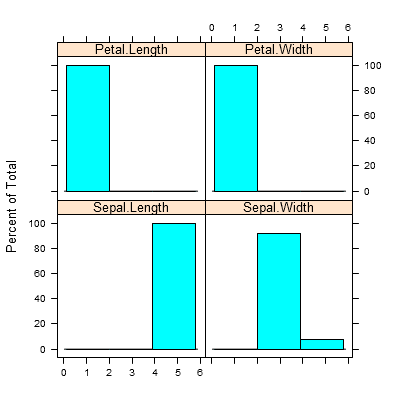
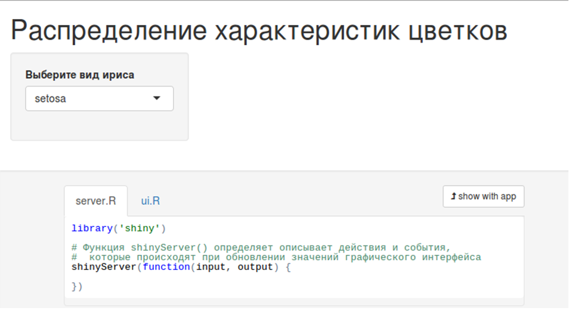
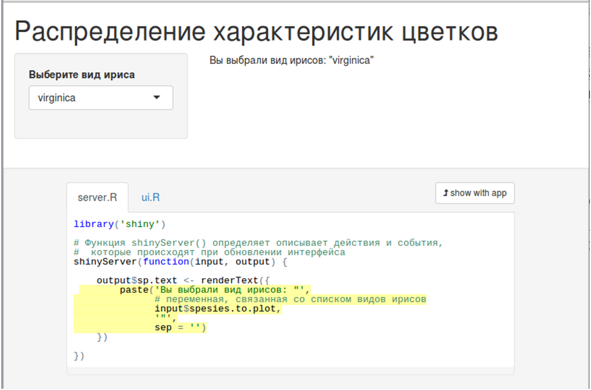
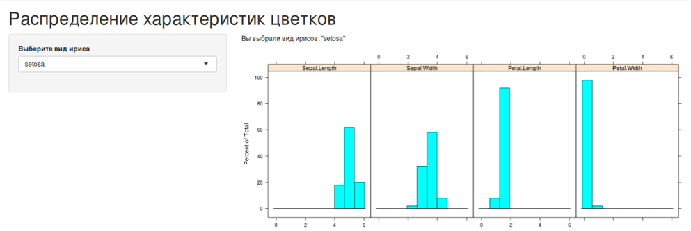
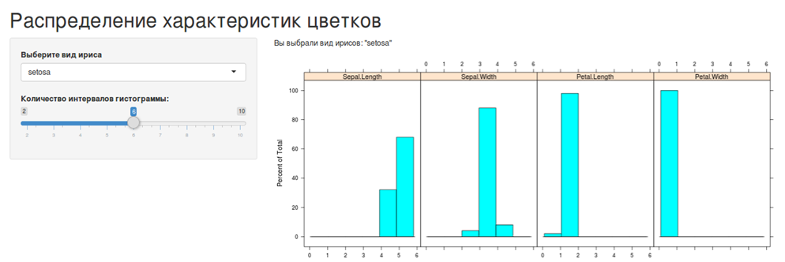
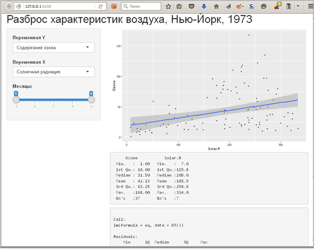
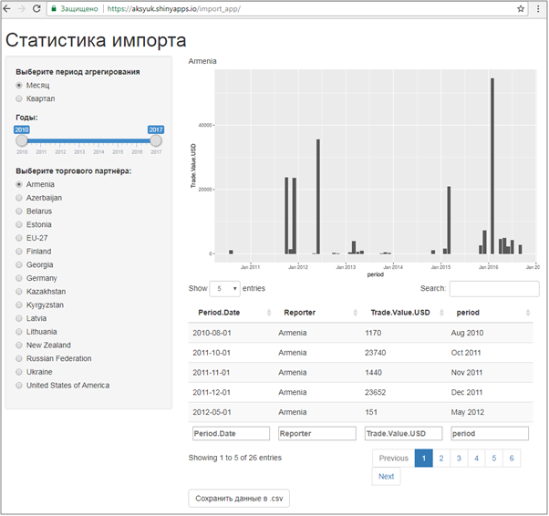

Ключевые слова: R[^1], r-project, RStudio  

Версия 2.0.0 (2019)  

Примеры выполнены R версии `r paste0(R.version$major, '.', R.version$minor)`, "`r R.version$nickname`".  

Версия RStudio: 1.1.453.  

Все ссылки действительны на 5 марта 2019 г.  

Файл с макетом кода для этой практики: [lab_2-4-2019_before.R](https://sites.google.com/a/kiber-guu.ru/r-practice/dpv/lab_2-4_before.R?attredirects=0&d=1)     

Шаблон кода приложения iris_hist_app: [iris_hist_app.zip](https://sites.google.com/a/kiber-guu.ru/r-practice/dpv/iris_hist_app.zip?attredirects=0&d=1)     

Шаблон кода приложения air_plot_app: [air_plot_app.zip](https://sites.google.com/a/kiber-guu.ru/r-practice/dpv/air_plot_app.zip?attredirects=0&d=1)     

Шаблон кода приложения import_app: [import_app.zip](https://sites.google.com/a/kiber-guu.ru/r-practice/dpv/import_app.zip?attredirects=0&d=1)     


```{r setup, include = F}
knitr::opts_chunk$set(
    echo = T,
    comment = "#>",
    collapse = T,
    fig.align = 'center'
    # fig.height = 4,
    # fig.width = 4
)

# пакеты
library('Cairo')
library('lattice')

# директории
if (!dir.exists('./plots')) {
    dir.create('./plots/')
}

# функция для форматирования чисел в тексте (2 знака после запятой)
comma <- function(x) {
    format(x, nsmall = 2, digits = 2, big.mark = ' ', decimal.mark = ',')
}

# функция для записи файла в UTF-8
# source: https://tomizonor.wordpress.com/2013/04/17/file-utf8-windows/
BOM <- charToRaw('\xEF\xBB\xBF')
writeUtf8 <- function(x, file, bom = F) {
  con <- file(file, "wb")
  if (bom) writeBin(BOM, con, endian = "little")
  writeBin(charToRaw(x), con, endian = "little")
  close(con)
}

# размеры графиков
png.width <- 400
png.height <- 400
```

##### Новая страница    

## Веб-приложения в пакете «shiny»         

\ \ \ \ \ Пакет «shiny» [^2] от создателей RStudio служит для разработки интерактивных графиков и таблиц в виде веб-страниц, причём знать HTML для этого необязательно. На веб-странице размещаются также элементы управления, с помощью которых пользователь может изменять настройки представления данных.
Приложение «shiny» хранится в отдельной папке в виде двух скриптов:    

* **`ui.R`** -- перечисляет все элементы интерфейса;   

* **`server.R`** -- описывает все действия с данными и события, которые происходят при изменении настроек пользователем. Здесь же записан код построения графиков, таблиц, отчётов.   

\ \ \ \ \ Для того чтобы поделиться созданным приложением можно воспользоваться одним из четырёх способов:    

* Опубликовать код на Gist. Файлы `ui.R` и `server.R` должны быть частью опубликованного сниппета. Например: <https://gist.github.com/3239667>. Для запуска любой пользователь с установленными R и Shiny может выполнить команду `shiny::runGist("3239667")`, где "3239667" -- Gist-идентификатор сниппета.   

* Опубликовать приложение на <www.shinyapps.io>. Ограничения бесплатного аккаунта: 5 приложений и 25 активных часов в месяц (т.е. суммарное время, которое приложение доступно пользователям).   

* Конвертировать приложение в R-пакет.   

* Послать заархивированную директорию с файлами приложения человеку, с которым Вы им хотите поделиться [^3].    

\ \ \ \ \ **Пример №1.** Создадим приложение, которое строит гистограммы распределения характеристик цветка ириса из встроенного набора данных `iris`. Пользователь сможет выбирать один из трёх видов ирисов и ширину интервала гистограммы.    

\ \ \ \ \ Посмотрим справку по исходным данным и определим, какие виды ирисов представлены в файле.    

```{r paragraph-01-chunk-01-1,}
# Загрузка пакетов
library('shiny') # интерактивные приложения shiny
```

```{r paragraph-01-chunk-01-2, eval = F}
# встроенный набор данных по ирисам
?iris
```

```{r paragraph-01-chunk-01-3}
# все уникальные значения видов ирисов
unique(iris$Species)
```

\ \ \ \ \ Сохраним эти уникальные значения в именованном списке, чтобы потом использовать это в нашем приложении.   
 
```{r paragraph-01-chunk-02}
# список уникальных значений столбца Species для фильтрации данных
sp.filter <- as.character(unique(iris$Species))
names(sp.filter) <- sp.filter
sp.filter <- as.list(sp.filter)
sp.filter
```

\ \ \ \ \ Зададим количество интервалов для гистограмм.   

```{r paragraph-01-chunk-03}
# количество интервалов для гистограммы
hist.int <- 3
```

\ \ \ \ \ Теперь построим график, который будет рисовать наше приложение. В коде графика выделены те параметры, которые наше приложение позволит изменять: вид ириса для отбора данных и количество интервалов. Сейчас эти параметры хранятся в локальных переменных. Вид графика показан на рисунке 1.    

```{r paragraph-01-chunk-04-hidden, include = F}
# гистограммы характеристик ириса
# сначала фильтруем данные
DF <- iris[iris$Species == sp.filter[1], 1:4]

# затем строим гистограммы переменных
Cairo('./plots/plot-01.png', , width = png.width, height = png.height)
histogram( ~ Sepal.Length + Sepal.Width + Petal.Length + Petal.Width, 
           data = DF,
           xlab = '',
           breaks = seq(min(DF), max(DF), 
                        length = hist.int + 1))
dev.off()
```

```{r paragraph-01-chunk-04, eval = F}
# гистограммы характеристик ириса
# сначала фильтруем данные
DF <- iris[iris$Species == sp.filter[1], 1:4]
# затем строим гистограммы переменных
histogram( ~ Sepal.Length + Sepal.Width + Petal.Length + Petal.Width, 
           data = DF,
           xlab = '',
           breaks = seq(min(DF), max(DF), 
                        length = hist.int + 1))
```

     

\ \ \ \ \ Теперь напишем код приложения для интерактивной настройки этого графика, используя архитектуру из двух файлов: `server.R` и `ui.R`. Создадим директорию и файлы приложения внутри рабочей папки R.    


```{r paragraph-01-chunk-05, eval = F}
# создать папку для файлов приложения
if (!file.exists('./iris_hist_app')) {
    dir.create('./iris_hist_app')}

# создать файлы приложения
# ui.R
if (!file.exists('./iris_hist_app/ui.R')) {
    file.create('./iris_hist_app/ui.R')}
# server.R
if (!file.exists('./iris_hist_app/server.R')) {
    file.create('./iris_hist_app/server.R')}
```

\ \ \ \ \ Дальше изменяем файлы приложения. Начнём с **`ui.R`**.   

```{r paragraph-01-chunk-06, eval = F}
# ФАЙЛ ui.R -------------------------------------------------
# загрузка пакетов
library('shiny')

# список уникальных значений столбца Species для фильтрации данных
sp.filter <- as.character(unique(iris$Species))
names(sp.filter) <- sp.filter
sp.filter <- as.list(sp.filter)

# размещение всех объектов на странице
shinyUI(
    # создать страницу с боковой панелью 
    # и главной областью для отчётов
    pageWithSidebar(
        # название приложения:
        headerPanel('Распределение характеристик цветков'),
        # боковая панель:
        sidebarPanel(
            # выпадающее меню: вид ирисов 
            # для фильтра наблюдений
            selectInput('sp.to.plot',       # связанная переменная
                        'Выберите вид ириса',  # подпись списка
                        sp.filter),            # сам список
        # главная область (пока пустая)
        mainPanel()
    ))
```

\ \ \ \ \ В файл `server.R` запишем пока только «скелет»: пустую функцию `shinyServer()`.    

```{r paragraph-01-chunk-07, eval = F}
# ФАЙЛ server.R ------------------------------------------------
# загрузка пакетов
library('shiny')
# Функция shinyServer() определяет описывает действия и события, 
#  которые происходят при обновлении значений интерфейса
shinyServer(function(input, output) {
    # пока здесь пусто
})
```

\ \ \ \ \ Файлы `ui.R` и `server.R` нужно обязательно сохранить в кодировке UTF-8, иначе приложение не запустится. Если вы работаете в ОС Linux, это будет сделано автоматически. Под Windows нужно выбрать пункт меню RStudio «File»  «Save with Encoding…» и выбрать «UTF-8».    

\ \ \ \ \ На этом этапе приложение можно запустить. Для этого можно воспользоваться кнопкой «Rup App» над окном редактора скрипта в RStudio либо функцией `runApp()`. Некоторые аргументы функции:   

* `appDir` (первый аргумент) -- путь к папке с приложением;   

* `launch.browser` -- логический: если `TRUE`, приложение откроется в браузере, если `FALSE` -- в отдельном окне RStudio;   

* `display.mode` -- тип отображения приложения. Аргумент принимает три значения: «showcase» -- код приложения приводится на той же веб-странице под приложением; «normal» -- будет показано только приложение, без исходного кода; «auto» -- использовать настройки RStudio по умолчанию (обычно это «normal»).   

```{r paragraph-01-chunk-08, eval = F}
# запустить приложение в браузере с отображением исходного кода
runApp('./iris_hist_app', launch.browser = T,
       display.mode = 'showcase')
```

\ \ \ \ \ Вид приложения в режиме «showcase» показан на рисунке 2. Слева на боковой панели находится поле со списком видов ирисов. Под приложением на отдельных вкладках размещён код из файлов `ui.R` и `server.R`.    

    

\ \ \ \ \ Пока при выборе вида ирисов ничего не происходит. Добавим в главную область страницы приложения интерактивный текст, который будет отображать значение переменной, связанной с выпадающим списком.    

\ \ \ \ \ Остановить работу приложения можно, нажав на кнопку «Stop» над окном консоли в RStudio.   

\ \ \ \ \ После того, как приложение остановлено, его можно редактировать. Добавим на главную область приложения текстовую строку, которая будет показывать, какой тип ирисов выбран в данный момент.   

\ \ \ \ \ Семейство функций пакета «shiny» для вывода результатов включает:    

* `htmlOutput()` -- создаёт и отображает HTML (в теге <div>);   

* `imageOutput()` -- изображение;   

* `plotOutput()` -- график;   

* `tableOutput()` -- таблицу;   

* `textOutput()` -- текст в теге <div>, символы перевода на следующую строку теряются;   

* `uiOutput()` -- HTML;   

* `verbatimTextOutput()` -- текст в теге <pre>, символы перевода на следующую строку сохраняются; подходит для отображения отчётов из консоли, в частности, вывода функции `summary()`.   

\ \ \ \ \ Эти функции размещаются внутри функций `sidebarPanel()` (боковая панель страницы) или `mainPanel()` (главная область) в файле `ui.R`. Добавим вывод текста в главную область страницы:   

```{r paragraph-01-chunk-09, eval = F}
# ФАЙЛ ui.R -------------------------------------------------
# загрузка пакетов
library('shiny')

# список уникальных значений столбца Species для фильтрации данных
sp.filter <- as.character(unique(iris$Species))
names(sp.filter) <- sp.filter
sp.filter <- as.list(sp.filter)

# размещение всех объектов на странице
shinyUI(
    pageWithSidebar(
        # этот код остаётся без изменений
        ),
        # главная область
        mainPanel(
          # текстовый объект для отображения
          textOutput('sp.text'))))
```

\ \ \ \ \ Структура приложений «shiny» такова, что каждой функции вида *Output в `ui.R` соответствует функция вида render* в `server.R`. Функции вида render\* собирают и готовят объект к отображению:   

* `renderImage()` -- для изображения (как ссылка к файлу-источнику);   

* `renderPlot()` -- для графиков;   

* `renderPrint()` -- результат функции, предназначенный для печати (вывода в консоль);   

* `renderTable()` -- фреймы данных, матрицы, другие табличные структуры;   

* `renderText()` -- символьные строки;    

* `renderUI()` -- объект «shiny tag» или HTML.    

\ \ \ \ \ Каждая функция вида render* принимает аргумент, который записывается в фигурных скобках \{\}. Аргументом может быть одна или несколько строк кода R. Этот код хранится как инструкция для приложения. Эта инструкция будет выполнена, когда приложение запустится в первый раз, и далее каждый раз, когда потребуется обновление элемента страницы [^4].   

\ \ \ \ \ Теперь «соберём» объект «sp.text» на сервере приложения.    

```{r paragraph-01-chunk-10, eval = F}
# ФАЙЛ server.R ------------------------------------------------
# загрузка пакетов
library('shiny')
# Функция shinyServer() определяет описывает действия и события, 
#  которые происходят при обновлении интерфейса
shinyServer(function(input, output) {
    # текст для отображения на главной панели
    output$sp.text <- renderText({
        paste('Вы выбрали вид ирисов: "',
              # переменная, связанная со списком видов ирисов
              input$sp.to.plot,
              '"', sep = '')
    })
})
```

\ \ \ \ \ Если снова запустить приложение, мы увидим картину, показанную на рисунке 3. При выборе значения из списка будет запускаться код из созданной на сервере функции `renderText()` (выделен жёлтым на рисунке).   

    

\ \ \ \ \ Осталось добавить к приложению гистограммы всех переменных, кроме переменной «Species», для наблюдений за заданным видом ирисов. Построим этот график с помощью пакета «lattice».   

```{r paragraph-01-chunk-11, eval = F}
# ФАЙЛ server.R -----------------------------------------------------
library('shiny')        # загрузка пакетов
library('lattice')
# Функция shinyServer() определяет описывает действия и события, 
#  которые происходят при обновлении интерфейса
shinyServer(function(input, output) {
    output$sp.text <- renderText({
        paste('Вы выбрали вид ирисов: "',
              input$sp.to.plot,
              '"', sep = '')
    })
# строим гистограммы переменных
    output$sp.hist <- renderPlot({
histogram( ~ Sepal.Length + Sepal.Width + Petal.Length + Petal.Width, 
          data = iris[iris$Species == input$sp.to.plot, 1:4],
          xlab = '')
    })
})
```


```{r paragraph-01-chunk-12, eval = F}
# ФАЙЛ ui.R ---------------------------------------------------------
# загрузка пакетов
library('shiny')

# размещение всех объектов на странице
shinyUI(
  # создать страницу с боковой панелью и главной областью для отчётов
    pageWithSidebar(
        # название приложения:
        headerPanel('Распределение характеристик цветков'),
        # боковая панель
        sidebarPanel(
            # выпадающее меню: вид ирисов для фильтра наблюдений
            selectInput('sp.to.plot',          # связанная переменная
                        'Выберите вид ириса',  # подпись списка
                        sp.filter),            # сам список
        # главная область
        mainPanel(
          # текстовый объект для отображения
          textOutput('sp.text'),
          # гистограммы переменных
          plotOutput('sp.hist')
        )
    ))
```

\ \ \ \ \ Результат с `display.mode = 'normal'` показан на рисунке 4.   

   

\ \ \ \ \ Осталось добавить возможность регулирования ширины интервалов гистограммы. Нам нужно добавить в функцию `histogram()` аргумент `breaks` с минимальным, максимальным значениями переменных и с шириной интервала, которую мы привяжем к элементу управления «slider». Дадим возможность пользователю построить гистограмму с числом интервалов от 2 до 10 (число наблюдений по каждому из видов равно 50). По умолчанию назначим слайдеру число интервалов, рассчитанное по правилу Стёрджеса [^5].    

\ \ \ \ \ Вот как изменятся файлы приложения:    

```{r paragraph-01-chunk-13, eval = F}
# ФАЙЛ ./iris_hist_app/ui.R -----------------------------------------
library('shiny')           # загрузка пакетов

# размещение всех объектов на странице
shinyUI(
  # создать страницу с боковой панелью и главной областью для отчётов
    pageWithSidebar(
        # название приложения:
        headerPanel('Распределение характеристик цветков'),
        # боковая панель
        sidebarPanel(
            # выпадающее меню: вид ирисов для фильтра наблюдений
            selectInput('sp.to.plot',     # связанная переменная
                        'Выберите вид ириса',  # подпись списка
                        sp.filter),            # сам список
        # слайдер для количества интервалов гистограммы
        sliderInput('int.hist', 'Количество интервалов гистограммы:', 
                    min = 2, max = 10, 
                    value = floor(1 + log(50, base = 2)), 
                    step = 1)
        ),
        # главная область
        mainPanel(
          # текстовый объект для отображения
          textOutput('sp.text'),
          # гистограммы переменных
          plotOutput('sp.hist'))))
```

```{r paragraph-01-chunk-14, eval = F}
# ФАЙЛ ./iris_hist_app/server.R -------------------------------------
library('shiny')         # загрузка пакетов
library('lattice')

# Функция shinyServer() определяет описывает действия и события, 
#  которые происходят при обновлении интерфейса
shinyServer(function(input, output) {
    output$sp.text <- renderText({
        paste('Вы выбрали вид ирисов: "',
              # переменная, связанная со списком видов ирисов
              input$sp.to.plot,
              '"', sep = '')
    })
    output$sp.hist <- renderPlot({
# сначала фильтруем данные
DF <- iris[iris$Species == input$sp.to.plot, 1:4]
# затем строим гистограммы переменных
histogram( ~ Sepal.Length + Sepal.Width + Petal.Length + Petal.Width, 
          data = DF,
          xlab = '',
          breaks = seq(min(DF), max(DF), 
          length = input$int.hist + 1))
    })
})
```

\ \ \ \ \ Готовое приложение показано на рисунке 5.     

   

\ \ \ \ \ **Пример №2**. Создадим приложение, которое строит график разброса, таблицу описательных статистик и отчёт по модели регрессии двух переменных из встроенного набора данных `airquality`. Построим график в пакете «ggplot2». Дадим пользователю возможность выбирать переменные и месяцы, за которые берутся наблюдения.    

\ \ \ \ \ Сначала посмотрим на данные.    

```{r paragraph-01-chunk-15, eval = F}
# встроенный набор данных airquality
?airquality
```

```{r paragraph-01-chunk-16}
# переменные в таблице
names(airquality)
```

\ \ \ \ \ Таблица включает переменные «Month» (месяц наблюдения) и «Day» (день наблюдения). Посмотрим, насколько полно представлены данные, подсчитав, сколько наблюдений приходится на каждый месяц. Для этого воспользуемся специальным выражением объекта «data.table», которое подсчитывает количество наблюдений: `.N`.    

```{r paragraph-01-chunk-17}
# загрузка пакетов
library('data.table') # работаем с объектом "таблица данных"

# число наблюдений по месяцам
DT <- data.table(airquality)
DT[, .N, by = Month]
```

\ \ \ \ \ Похоже, данные с мая (месяц 5) по сентябрь (месяц 9) приводятся без пропусков. Создаём файлы приложения.    

```{r paragraph-01-chunk-18, eval = F}
# создать папку для файлов приложения
if (!file.exists('./air_plot_app')) {
    dir.create('./air_plot_app')}
# создать файлы приложения
if (!file.exists('./air_plot_app/server.R')) {
    file.create('./air_plot_app/server.R')}
if (!file.exists('./air_plot_app/ui.R')) {
    file.create('./air_plot_app/ui.R')}
```

\ \ \ \ \ Далее редактируем файлы приложения. Начнём с **`ui.R`**.   

```{r paragraph-01-chunk-19, eval = F}
# ФАЙЛ ./air_plot_app/ui.R ------------------------------------------
library('shiny')              # загрузка пакетов

shinyUI(
    pageWithSidebar(
        # название приложения:
        headerPanel('Разброс характеристик воздуха, Нью-Йорк, 1973'),
        # боковая панель:
        sidebarPanel(
         # выпадающий список: переменная по оси 0Y
         selectInput('Y.var',    # переменная
                     'Переменная Y',
                     # список:
                     list('Содержание озона' = 'Ozone', 
                        'Солнечная радиация' = 'Solar.R', 
                        'Средняя скорость ветра' = 'Wind',
                        'Максимальная дневная температура' = 'Temp'),
                        selected = 'Ozone'),
         # выпадающий список: переменная по оси 0X 
         selectInput('X.var',    # переменная
                     'Переменная X',
                     # список:
                     list('Содержание озона' = 'Ozone', 
                        'Солнечная радиация' = 'Solar.R', 
                        'Средняя скорость ветра' = 'Wind',
                        'Максимальная дневная температура' = 'Temp'),
                        selected = 'Solar.R'),
            # слайдер: месяцы для отбора наблюдений
            sliderInput('month.range', 'Месяцы:',
                        min = 5, max = 9, value = c(5, 9))
        ),
        # главная область
        mainPanel(
            # график разброса переменных
            plotOutput('gplot'),
            # описательные статистики
            verbatimTextOutput('XY.summary'),
            # модель
            verbatimTextOutput('lm.result')
        )
    ))
```

\ \ \ \ \ Теперь распишем серверную часть. Обратим внимание, что данные придётся фильтровать в зависимости от того, какие переменные и месяцы выбрал пользователь. Причём делать это придётся не один раз, поскольку на одних и тех же данных нужно построить график, таблицу описательных статистик и модель линейной регрессии. Чтобы не фильтровать данные внутри каждой функции вида `render*`, создадим фрейм DF, который будет меняться в ответ на выбор пользователя, и будем обращаться за данными к нему. Дословно в терминологии «shiny» такой объект называется «reactive» – реагирующий. Код серверной части:    
```{r paragraph-01-chunk-20, eval = F}
# ФАЙЛ ./air_plot_app/server.R --------------------------------------
library('shiny')              # загрузка пакетов
library('ggplot2')
library('data.table')
library('dplyr')
shinyServer(function(input, output) {
    # реагирующий фрейм с данными
    DT <- reactive({
        DT <- data.table(airquality)
        select(DT[between(Month, input$month.range[1], 
                   input$month.range[2]), ],
               input$Y.var, input$X.var)
    })
    # график разброса с линией регрессии
    output$gplot <- renderPlot({
        gp <- ggplot(data = DT(), aes_string(x = input$X.var,
                                             y = input$Y.var))
        gp <- gp + geom_point() + geom_smooth(method = 'lm')
        gp
    })
    # таблица с описательными статистиками
    output$XY.summary <- renderPrint({
        summary(DT())
    })
    # отчёт по модели регрессии
    output$lm.result <- renderPrint({
        eq <- as.formula(paste(input$Y.var, ' ~ ', input$X.var))
        mod <- lm(eq, data = DT())
        summary(mod)
    })
})
```

\ \ \ \ \ Вид окна приложения показан на рисунке 6.    

   


\ \ \ \ \ При создании реагирующего фрейма `DT()` была использована функция `select()` из пакета «dplyr» [^6].    

\ \ \ \ \ В первых двух примерах практики мы разобрали работу со встроенными наборами данных. В следующем приложении «shiny» мы вернёмся к данным по импорту из базы UN COMTRADE, и посмотрим, как включать код загрузки данных в приложение. Но сначала рассмотрим способы трансформации и агрегирования данных по различным периодам времени.    


## Трансформация и агрегирование данных по импорту масла     

\ \ \ \ \ **Пример №3**. Вернёмся к примеру с данными по импорту сливочного масла в РФ из первой практики. Функции, перечисленные выше, работают как с фреймами, так и с таблицами данных. Для удобства вывода таблиц в консоли мы загрузим данные в объект «data.table».   

```{r paragraph-02-chunk-01}
# загружаем файл с данными по импорту масла в РФ
fileURL <- 'https://raw.githubusercontent.com/aksyuk/R-data/master/COMTRADE/040510-Imp-RF-comtrade.csv'
# создаём директорию для данных, если она не существует:
if (!file.exists('./data')) dir.create('./data')
# загружаем файл, если он не существует
if (!file.exists('./data/040510-Imp-RF-comtrade.csv')) {
    download.file(fileURL, 
                  './data/040510-Imp-RF-comtrade.csv')}
# читаем данные из загруженного .csv, если он не существует
if (!exists('DT.import')){
    DT.import <- data.table(read.csv('./data/040510-Imp-RF-comtrade.csv', as.is = T))}
```

\ \ \ \ \ Сделаем несколько выборок из фрейма функциями пакета «dplyr».   

```{r paragraph-02-chunk-02}
library('dplyr')               # трансформации данных

# выбираем столбцы функцией select
select(DT.import, Period, Reporter, Trade.Value.USD)

# добавляем условие на отбор строк функцией filter
filter(select(DT.import, Period, Reporter, Trade.Value.USD), 
       Reporter == 'EU-27')
```

\ \ \ \ \ Теперь воспользуемся функцией mutate(), чтобы агрегировать массу поставок по странам. Эту операцию проделаем в несколько шагов:   

1. С помощью функции select() выберем из исходной таблицы только столбцы Reporter (страна-экспортёр товара в РФ) и `Trade.Value.USD` (стоимость поставки в долларах США).   

1. C помощью функции `group_by()` разобьём то, что получилось, на подвыборки по переменной Reporter (страна-поставщик товара в РФ).    

1. Затем функцией mutate() создадим новую переменную    `Trade.Value.USD.by.country`, в которую запишем суммарную стоимость поставок из каждой страны.   

1. Все вышеперечисленные функции соединим последовательно каналом `%>%` [^7].   

\ \ \ \ \ Код, реализующий описанную выше последовательность операций, выглядит следующим образом:   

```{r paragraph-02-chunk-03}
# рассчитать суммарную массу поставок по каждой стране
select(DT.import, Reporter, Trade.Value.USD) %>% 
    group_by(Reporter) %>% 
    mutate(Trade.Value.USD.by.country = sum(Trade.Value.USD))
```

\ \ \ \ \ Отметим, что:   

1. Для расчёта переменной `Trade.Value.USD.by.country` необязательно отбирать только эти столбцы на первом шаге. Это было сделано для удобства представления результатов.   

1. Функция `group_by()` позволяет группировать данные таблицы по нескольким переменным.   

1. Код выше только выводит результат в консоль. Чтобы сохранить их в новом объекте, нужно добавить присваивание, например, перед функцией `select()`.   

\ \ \ \ \ Посмотрим на примере тех же данных по импорту, как можно работать с датами и агрегировать значения переменных по кварталам и по месяцам средствами пакетов «lubridate» и «zoo». Используем функции:    

* `as.character()`, чтобы перевести значения столбца Period из числовых в символьные.   

* `as.yearmon()`, чтобы перевести символьную строку вида «ГГГГММ» в формат ежемесячных данных. Второй аргумент этой функции задаёт формат даты. Нашему шаблону соответствует формат `'%Y%m'`: четыре цифры года и две цифры месяца без разделителя.    

* `as.POSIXct()`, чтобы перевести значение из класса «yearmon» (пакет «zoo») в класс дат «POSIXct» (более универсальный класс для хранения дат в R).    

* Наконец, функция `ceiling_date()` округляет дату вверх. Второй аргумент `unit = 'month'` означает, что функция вернёт первое число месяца, следующего за тем, к которому относится дата. Из этого значения мы вычтем один день (функция `day(1)`), а результат сохраним в новом столбце `Period.Date`.    

```{r paragraph-02-chunk-04}
library('lubridate')        # работа с датами, ceiling_date()
library('zoo')              # работа с датами, as.yearmon() 
# переводим период в дату: КОНЕЦ соответствующего месяца
DT.import[, Period.Date := ceiling_date(as.POSIXct(as.yearmon(as.character(Period), 
                                   '%Y%m')),
                        unit = 'month') - days(1)]
# что получилось
DT.import[, c('Period', 'Period.Date'), with = F]

# убираем столбец с периодом в виде текста, оставляем дату
DT.import <- select(DT.import, Period.Date, Reporter, 
                    Reporter, Trade.Value.USD)
# смотрим результат
head(DT.import, n = 3)
```

\ \ \ \ \ **Пример №4**. Ниже приводится код приложения «shiny», которое загружает данные по импорту масла в РФ, агрегирует их по месяцам либо по кварталам, по выбору пользователя, фильтрует по выбранной стране, строит график динамики и выводит таблицу. Результат – отфильтрованные и агрегированные данные – можно сохранить в файл с расширением «.csv».    

\ \ \ \ \ Обратите внимание, что файлы с загруженными данными и с результатами отбора наблюдений будут сохранены не в рабочей директории R, а в папке приложения «shiny».     

\ \ \ \ \ Вид приложения приводится на рисунке 7. Код размещён на github.com. Серверная часть: <https://github.com/aksyuk/DPV-R_Materials/blob/master/Labs/ Lab-03/import_app/server.R>; интерфейс: <https://github.com/aksyuk/DPV-R_Materials/blob/master/Labs/Lab-03/import_app/ui.R>.     
\ \ \ \ \ Рабочее приложение доступно по ссылке: <https://aksyuk.shinyapps.io/import_app/>.     

    


##### Новая страница    

## Упражнения   

### Упражнение 3      

\ \ \ \ \ Создать приложение «shiny», которое строит график из упражнения № 2 в соответствии с вариантом. Данные для графика загружать с UN COMTRADE, используя API сайта, работа с которым описана в первой практике. Дать пользователю возможность фильтровать статистику по трём показателям:    

* код товара, причём из списка в приложении должно быть понятно, что это за товары. В список кодов включить от 5 до 10 любых позиций.    

* страна-импортёр (или экспортёр). Список стран в приложении должен быть дан на русском языке.     

* товарный поток (импорт, экспорт, реэкспорт).     

\ \ \ \ \ Приложение – заархивированную папку с файлами `ui.R` и `server.R` – нужно выслать на почту [s.aksuk@kiber-guu.ru](mailto:s.aksuk@kiber-guu.ru) в течение двух недель.     


[//]: # Концевые сноски

[^1]: R Core Team (2015). R: A language and environment for statistical computing. R Foundation for Statistical Computing, Vienna, Austria. URL <https://www.R-project.org/>   

[^2]: Winston Chang, Joe Cheng, JJ Allaire, Yihui Xie and Jonathan McPherson (2016). shiny: Web Application Framework for R. R package version 0.13.1. <http://CRAN.R-project.org/package=shiny>   

[^3]: Знакомьтесь -- Shiny, пакет для создания интерактивных веб-приложений на основе R / Блог С.Мастицкого «R: Анализ и визуализация данных». URL: <http://r-analytics.blogspot.ru/2012/11/shiny-r.html>   

[^4]: Teach yourself Shiny / Руководство по «shiny» на <http://rstudio.com>. URL: <http://shiny.rstudio.com/tutorial/>   

[^5]: Правило Стёрджеса / Материал из Википедии -- свободной энциклопедии. URL: <https://ru.wikipedia.org/wiki/Правило_Стёрджеса>   

[^6]: Jeffrey Leek. Материалы курса «Getting and Cleaning Data» Университета Джонса Хопкинса на портале coursera.org, доступные в репозитории на <https://github.com>: <https://github.com/jtleek/modules/tree/master/03_GettingData>   

[^7]: Tal Galili. Simpler R coding with pipes > the present and future of the magrittr package / R-statistics blog (August 5, 2014). URL: <http://www.r-statistics.com/2014/08/simpler-r-coding-with-pipes-the-present-and-future-of-the-magrittr-package/>    
