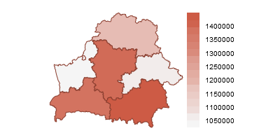
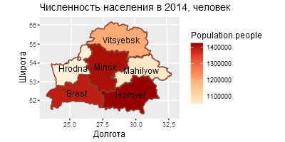

Ключевые слова: R[^1], r-project, RStudio  

Версия 2.0.0 (2019)  

Примеры выполнены R версии `r paste0(R.version$major, '.', R.version$minor)`, "`r R.version$nickname`".  

Версия RStudio: 1.1.453.  

Все ссылки действительны на 26 марта 2019 г.  

Файл с макетом кода для этой практики: [lab_2-5-2019_before.R](https://github.com/aksyuk/DPV-R_Materials/tree/master/Labs/Lab-05)     


```{r setup, include = F}
knitr::opts_chunk$set(
    echo = T,
    comment = "#>",
    collapse = T
    # fig.align = 'center'
    # fig.height = 4,
    # fig.width = 4
)

# пакеты
library('Cairo')
library('maptools')          # инструменты для создания картограмм
library('sp')                # функция spplot()
library('RColorBrewer')      # цветовые палитры
library('lattice')
# установка и сборка пакета «gpclib»
# install.packages('gpclib', type = 'source')
library('gpclib')
require('rgdal')                 # функция readOGR()
require('plyr')                  # функция join()
library('ggplot2')               # функция ggplot()
library('mapproj')               # работа с проекциями карт
library('scales')                # функция pretty_breaks()

gpclibPermit()

# library('dismo')    # gmap() для загрузки Google карты
# library('raster')   # функции для работы с растровыми картами

# директории
if (!dir.exists('./plots')) {
    dir.create('./plots/')
}

# функция для форматирования чисел в тексте (2 знака после запятой)
comma <- function(x) {
    format(x, nsmall = 2, digits = 2, big.mark = ' ', decimal.mark = ',')
}

# функция для записи файла в UTF-8
# source: https://tomizonor.wordpress.com/2013/04/17/file-utf8-windows/
BOM <- charToRaw('\xEF\xBB\xBF')
writeUtf8 <- function(x, file, bom = F) {
  con <- file(file, "wb")
  if (bom) writeBin(BOM, con, endian = "little")
  writeBin(charToRaw(x), con, endian = "little")
  close(con)
}

# размеры графиков
png.width <- 400
png.height <- 400
```

##### Новая страница    

## Создание статических картограмм         

### Коротко о форматах хранения геоданных    

\ \ \ \ \ В данной практике рассматриваются приёмы изображения данных на карте средствами R. При создании карты мы будем иметь дело с двумя источниками данных: во-первых, это экономические, социальные или иные показатели, привязанные к определённым точкам или территориям; во-вторых, сами геоданные. Форматы хранения геоданных (или данных GIS -- геоинформационных систем), делятся на два класса: растровые и векторные [^2]. Ниже перечислены лишь некоторые из существующих форматов файлов, которые поддерживаются пакетами R.        

1. **Растровые** (альтернативное англоязычное название -- grid, от слова «сетка»): GeoTIFF, ESRI, ENVI, ERDAS (пакеты «raster» [^3], «rgdal» [^4]). Данные в растровых форматах хранятся в таблицах, где каждая ячейка содержит информацию о цвете одного растра (пикселя) картинки. В таблице также может храниться дополнительная информация о пикселях: непрерывные переменные (как, например, средняя температура), дискретные переменные (статус использования земель), а также ссылки на связанные данные из других таблиц. Растровые форматы плохо масштабируемы и занимают в десятки раз больше места, чем векторные (в зависимости от разрешения), однако для их обработки требуется меньше вычислительных ресурсов.    

2. **Векторные** (или spatial, т.е. «пространственный»), к которым относятся Shapefile и GeoJSON (пакеты «rgdal», «rgeos» [^5]). В отличие от растровых форматов, используют не пиксельное, а геометрическое представление объектов в виде точек, линий и полигонов. Занимают меньше места и дают больше возможностей, от масштабирования до изменения координатной сетки, однако и требуют больших вычислительных мощностей.    

\ \ \ \ \ В упомянутом пакете «rgdal» реализован интерфейс для работы с открытой библиотекой GDAL/OGR (Geospatial Data Abstraction Library -- библиотека абстракции гео-пространственных данных [^6]), функционал которой позволяет работать более чем с 50 растровыми (GDAL) и 20 векторными (OGR) форматами [^7].   
\ \ \ \ \ Стоит упомянуть некоторые открытые источники геоданных:    

* Геоданные от русскоязычного проекта GIS-Lab (<http://gis-lab.info/qa.html#gis_data>);    

* OpenStreetMap -- открытая база административных границ, городов с точностью до улиц, которая поддерживается национальными агентствами и учреждениями Австрии, Канады, Финляндии, Франции, Нидерландов, Новой Зеландии, России, Словении, Южной Африки, Великобритании и других стран (<http://www.openstreetmap.org/>);    

* Google Earth -- глобальная база геоданных от Google (<https://www.google.com/earth/>);    

* GSHHS -- Глобальная непротиворечивая иерархическая база данных береговых линий высокого разрешения -- содержит информацию о береговых линиях океанов, озёр, рек и о границах государств (<http://www.ngdc.noaa.gov/mgg/shorelines/gshhs.html>);    

* Global Administrative Areas -- база границ административно-территориального деления (<http://www.gadm.org/country>);    

* База Программы ООН по окружающей среде предоставляет данные по наличию и использованию водных, лесных и других природных ресурсов, в том числе в формате Shapefile (<http://geodata.grid.unep.ch/>);    

* Открытая база компании MapCruzin -- границы регионов, города и статистика по населению (весь мир); более подробные данные представлены по США (<http://www.mapcruzin.com/>);    

* База свободной геоинформационной системы DIVA-GIS (<http://www.diva-gis.org/Data>);    

* База данных Natural Earth -- геоданные с атрибутами, предназначенные для создания карт небольшого масштаба (<http://www.naturalearthdata.com/>);    

* Свободная база топонимов, включает более восьми миллионов названий географических объектов (<http://geodata.grid.unep.ch/>);    

* Global Land One-kilometer Base Elevation (GLOBE) -- глобальная цифровая модель рельефа от независимых разработчиков, которая объединяет данные из открытых источников (<http://www.ngdc.noaa.gov/mgg/topo/report/>).    

\ \ \ \ \ В работе с картами часто возникает необходимость сделать карту стран мира или их регионов, чтобы наглядно представить экономические и социальные показатели цветовой заливкой. Такие визуальные представления называют *хороплетами*, и они часто оказываются нагляднее таблиц. В R хороплет можно простроить несколькими способами, но самым гибким является обработка Shape-файлов -- популярного формата хранения геоданных в векторном формате. Обработка Shape-файлов напрямую довольно затратна в вычислительном плане, но позволяет подогнать карту под любые требования.    

\ \ \ \ \ В этой практике мы познакомимся с некоторыми способами создания неподвижных картограмм. В R есть также инструменты для создания интерактивных карт, и их мы рассмотрим в следующей практике.    

\ \ \ \ \ Для начала стоит разобраться на простом примере, как работать с географическими координатами и проекциями.    


### Работа с векторной картой    

\ \ \ \ \ **Пример №1**. Построим картограмму регионов Республики Беларусь. Воспользуемся данными проекта www.gadm.org/ (Global Administrative Areas). С сайта проекта можно загрузить карты административных районов стран мира в формате ShapeFile, либо, зная код страны по стандарту ISO 3166-1, воспользоваться прямой ссылкой и загрузить данные в рабочую область R.
Нам понадобится пакет «maptools» [^11]:   
     

```{r paragraph-01-chunk-01-1, eval = F}
library('maptools')     # инструменты для создания картограмм
```

\ \ \ \ \ На сайте <http://www.gadm.org/country> выберем нужную страну и формат файла (Рис. 1). В списке форматов также присутствует опция «R (SpartialPolygonsDataFrame)», которой мы воспользуемся позже.        

 

\ \ \ \ \ На странице, которая открывается после нажатия кнопки «Ok», есть ссылка на файл («download»). Скопируем её и загрузим файл скриптом R:    


```{r paragraph-01-chunk-01-2}
# ссылка на файл
ShapeFileURL <- 
 "http://biogeo.ucdavis.edu/data/gadm2.8/shp/BLR_adm_shp.zip"
# создаём директорию 'data' и скачиваем
if (!file.exists('./data')) dir.create('./data')
if (!file.exists('./data/BLR_adm_shp.zip')) {
    download.file(ShapeFileURL, 
                  destfile = './data/BLR_adm_shp.zip')}
```

\ \ \ \ \ Файл, который мы скачали -- это архив формата «.zip». Распакуем его.     

```{r paragraph-01-chunk-01-3}
# распаковать архив
unzip('./data/BLR_adm_shp.zip', exdir = './data/BLR_adm_shp')
# посмотреть список файлов распакованного архива
dir('./data/BLR_adm_shp')
```

\ \ \ \ \ Формат ShapeFile -- это набор файлов с расширениями «.cpg», «.csv», «.dbf», «.prj», «.shp», «.shx», причём объекты разных типов (точки, линии, полигоны и другие) хранятся в разных файлах.     

\ \ \ \ \ Главным является файл «.shp», который содержит данные о геометрии объектов. В файле «.dbf» хранятся атрибуты объектов. Элементы двух файлов связаны: атрибуты первого объекта, который хранится в первом кортеже «.shp» (т.е. смещение по строкам 0 в «.shp») хранятся в первом кортеже «.dbf» (смещение по строкам также 0). Существует связь взаимно однозначное соответствие между кортежами геометрии и кортежами атрибутов. Файл «.prj» -- это проекция геометрических компонент. Проекции особенно важны, если нужно совместить несколько карт из разных файлов (источников) [^12].    

\ \ \ \ \ В нашем случае данные представлены ещё и на нескольких уровнях иерархии (индексы 0, 1, 2 в названиях файлов). Попробуем разобраться, чем отличаются уровни иерархии друг от друга. Воспользуемся функцией `plot()`, чтобы сделать простейшее представление контурных карт. Результат, показанный на Рис. 2, далёк от совершенства, однако он даёт понять, что уровень «0» -- это границы государства, уровень «1» -- регионов, «2» -- административных районов.    

```{r paragraph-01-chunk-01-4, eval = F}
# прочитать данные уровней 0, 1, 2
Regions0 <- readOGR("./data/BLR_adm_shp/BLR_adm0.shp")
Regions1 <- readOGR("./data/BLR_adm_shp/BLR_adm1.shp")
Regions2 <- readOGR("./data/BLR_adm_shp/BLR_adm2.shp")
# контурные карты для разных уровней иерархии
par(mfrow = c(1, 3))
par(oma = c(0, 0, 0, 0))
par(mar = c(0, 0, 1, 0))
plot(Regions0, main = 'adm0', asp = 1.8)
plot(Regions1, main = 'adm1', asp = 1.8)
plot(Regions2, main = 'adm2', asp = 1.8)             # Рис. 2
par(mfrow = c(1, 1))
```

```{r paragraph-01-chunk-01-4-hidden, include = F}
# прочитать данные уровней 0, 1, 2
Regions0 <- readOGR("./data/BLR_adm_shp/BLR_adm0.shp")
Regions1 <- readOGR("./data/BLR_adm_shp/BLR_adm1.shp")
Regions2 <- readOGR("./data/BLR_adm_shp/BLR_adm2.shp")

Cairo('./plots/plot-01.png', width = png.width, height = 150)
# контурные карты для разных уровней иерархии
par(mfrow = c(1, 3))
par(oma = c(0, 0, 0, 0))
par(mar = c(0, 0, 1, 0))
plot(Regions0, main = 'adm0', asp = 1.8)
plot(Regions1, main = 'adm1', asp = 1.8)
plot(Regions2, main = 'adm2', asp = 1.8)             # Рис. 2
par(mfrow = c(1, 1))
dev.off()
```


\ \ \ \ \ Итак, если нас интересует уровень регионов Республики Беларусь, нужно выбирать файлы с индексом «1» в названии. Далее работаем с данными из объекта Regions1, остальные можно удалить.    

```{r paragraph-01-chunk-01-5}
# убрать лишние объекты из памяти
rm(Regions0, Regions2)
```

\ \ \ \ \ Если мы посмотрим структуру объекта «Regions1» с помощью функции `str()`, увидим, что это объект, состоящий из нескольких слотов, каждый из которых имеет собственную сложную структуру. Из соображений экономии места, приведём здесь только имена этих слотов.    

```{r paragraph-01-chunk-01-6}
# имена слотов
slotNames(Regions1)
```

\ \ \ \ \ Слот «`data`» -- это фрейм, который содержит сводную информацию о регионах, представленных в файле. При обращении к слоту нужно отделять его имя от имени объекта символом «`@`».    

```{r paragraph-01-chunk-01-7}
# слот "данные"
Regions1@data
```

\ \ \ \ \ Координаты областей содержатся в слоте «`Regions@polygons`» («полигоны»). Чтобы сделать картограмму Республики Беларусь, на которой каждый регион залит своим цветом, нужно сделать из переменной «`NAME_1`» фактор, поскольку мы будем использовать её значения для цветов.    

```{r paragraph-01-chunk-01-8}
# делаем фактор из имён областей (т.е. нумеруем их)
Regions1@data$NAME_1 <- as.factor(Regions1@data$NAME_1)
# результат
Regions1@data$NAME_1
```

\ \ \ \ \ Чтобы построить график, воспользуемся функцией `spplot()` пакета «`sp`» [^13] [^14]. Эта функция использует графическую систему «`lattice`» и предлагает более двадцати аргументов для настройки графика (см. `?spplot`). Мы используем лишь основные, добавив на карту координатную сетку и заливку регионов цветом. Для создания палитры цветов используем функцию `rainbow()`, которая возвращает цвета радуги. Результат более предпочтителен, чем график, построенный выше средствами базовой графической системы R.    

```{r paragraph-01-chunk-01-9, eval = F}
# загрузка пакета
library('sp')                          # функция spplot()
```


```{r paragraph-01-chunk-01-10-hidden, include = F}
Cairo('./plots/plot-03.png', width = png.width, height = 200)
# строим картограмму
spplot(Regions1,       # объект 'SpatialPolygonsDataFrame'
       'NAME_1',       # показанная цветом переменная
       scales = list(draw = T),        # рисовать координатную сетку
       col.regions = rainbow(n = 6)   # цвета для заливки
       )         # Рис. 3
dev.off()
```

```{r paragraph-01-chunk-01-10, eval = F}
# загрузка пакета
library('sp')                          # функция spplot()
# строим картограмму
spplot(Regions1,       # объект 'SpatialPolygonsDataFrame'
       'NAME_1',       # показанная цветом переменная
       scales = list(draw = T), # рисовать координатную сетку
       col.regions = rainbow(n = 6)  # цвета для заливки
       )                                          # Рис. 3
```


\ \ \ \ \ В пакете "RColorBrewer" собраны варианты цветовых палитр на все случаи жизни: для изображения категориальных, порядковых и количественных показателей [^15]. Перестроим последнюю карту с другим вариантом заливки регионов и без координатной сетки.   

```{r paragraph-01-chunk-01-10-1-hidden, include = F}
Cairo('./plots/plot-04-1.png', width = png.width, height = 200)
# вариант с палитрой из пакета ColorBrewer и без координатной сетки
spplot(Regions1, "NAME_1",
       col.regions = brewer.pal(6, "Set3"),
       par.settings = list(axis.line = list(col = NA)))     # Рис. 4
dev.off()
```

```{r paragraph-01-chunk-01-10-1c, eval = F}
# вариант с палитрой из пакета ColorBrewer и без координатной сетки
spplot(Regions1, "NAME_1",
       col.regions = brewer.pal(6, "Set3"),
       par.settings = list(axis.line = list(col = NA)))     # Рис. 4
```


\ \ \ \ \ **Пример №2**. Построим картограмму регионов Республики Беларусь, раскрасив регионы по значениям непрерывного количественного показателя. Код основан на примере из книги [^16].    

\ \ \ \ \ На сайте <www.belstat.gov.by> приводится официальная статистика социально-экономических показателей Республики Беларусь. Сборник «Регионы Республики Беларусь, 2015» [^17] [^18] содержит годовую статистику на конец 2014 года в разрезе регионов. Несколько показателей за 2014 год сохранены в файле с расширением «.csv», размещённом на <github.com/aksyuk>.    

```{r paragraph-01-chunk-01-11}
# загружаем статистику с показателями по регионам
fileURL <- 'https://raw.githubusercontent.com/aksyuk/R-data/master/STATE_STAT/BLR_Regions_2014.csv'
stat.Regions <- read.csv2(fileURL, stringsAsFactors = F)
# содержимое таблицы
stat.Regions
```

\ \ \ \ \ Регионы в файле со статистикой «`stat.Regions`» (столбец «`Region`») называются так же, как в объекте с картой «`Regions`» (столбец «`NAME_1`»). Добавим численность населения в слот «`Regions@data`», используя столбцы с названиями регионов как ключи.    

```{r paragraph-01-chunk-01-12}
# вносим данные в файл карты
Regions1@data <- merge(Regions1@data, stat.Regions, 
                       by.x = 'NAME_1', by.y = 'Region')
```

\ \ \ \ \ Осталось задать палитру цветов и построить картограмму.    

```{r paragraph-01-chunk-01-13-hidden, include = F}
# задаём палитру
mypalette <- colorRampPalette(c('whitesmoke', 'coral3'))

Cairo('./plots/plot-04.png', width = png.width, height = 200)
# строим картограмму численности населения
spplot(Regions1, 'Population.people',
       col.regions = mypalette(20),  # цветовая шкала 
                                     # (20 градаций)
       col = 'coral4',               # цвет контурных линий 
       par.settings = list(axis.line = list(col = NA)) # без осей
       )      # Рис. 4
dev.off()
```

```{r paragraph-01-chunk-01-13, eval = F}
# загрузка пакета
library('RColorBrewer')                # цветовые палитры
# задаём палитру
mypalette <- colorRampPalette(c('whitesmoke', 'coral3'))
# строим картограмму численности населения
spplot(Regions1, 'Population.people',
       col.regions = mypalette(20),  # цветовая шкала 
                                     # (20 градаций)
       col = 'coral4',               # цвет контурных линий 
       par.settings = list(axis.line = list(col = NA)) # без 
                                                       # осей
)      # Рис. 4
```




\ \ \ \ \ Эта картограмма будет нагляднее, если добавить на неё названия регионов. Поскольку `spplot()` строит график средствами «`lattice`», для добавления текста на картограмму понадобится добавить в вызов функции аргумент «`panel`».    

```{r paragraph-01-chunk-01-14-hidden, include = F}
Cairo('./plots/plot-05.png', width = png.width, height = 200)
# то же - с названиями областей
spplot(Regions1, 'Population.people', 
       col.regions = mypalette(16), col = 'coral4', 
       main = 'Численность населения, человек',
       panel = function(x, y, z, subscripts, ...) {
         panel.polygonsplot(x, y, z, subscripts, ...)
         sp.text(coordinates(Regions1),
                 Regions1$NAME_1[subscripts])}
)      # Рис. 8

# пример окончен, удаляем большой объект из памяти
rm(Regions1)
dev.off()
```

```{r paragraph-01-chunk-01-14, eval = F}
# то же - с названиями областей
spplot(Regions1, 'Population.people', 
       col.regions = mypalette(16), col = 'coral4', 
       main = 'Численность населения, человек',
       panel = function(x, y, z, subscripts, ...) {
         panel.polygonsplot(x, y, z, subscripts, ...)
         sp.text(coordinates(Regions1),
                 Regions1$NAME_1[subscripts])}
)      # Рис. 8

# пример окончен, удаляем большой объект из памяти
rm(Regions1)
```


\ \ \ \ \ **Пример №3**. Построим последний график с помощью пакета «ggplot2».    

\ \ \ \ \ Функция `ggplot()`, с помощью которой мы построим картограмму, требует, чтобы данные были представлены в формате фрейма и содержали как переменные локаций, так и показатель для заливки регионов цветом.   

\ \ \ \ \ Сначала импортируем данные заново с помощью функции `readOGR()` пакета «`rgdal`». В результате получим объект в формате «`SpatialPolygonsDataFrame`», который преобразуем во фрейм функцией `fortify()`. Эта функция создаст таблицу, в которой каждая строка будет соответствовать точке какого-то из полигонов. Координаты точек хранятся в переменных «`long`» (долгота) и «`lat`» (широта), а название полигона (т.е. региона), к которому относится точка, записан в столбце «`group`».    

\ \ \ \ \ В операционной системе Windows для работы `fortify()` нужно установить пакет «`gpclib`». Для его корректной установки нужно установить программу «Rtools», последнюю версию которой можно скачать по адресу: <https://cran.r-project.org/bin/windows/Rtools/>. Инструкции по установке: <https://github.com/stan-dev/rstan/wiki/Install-Rtools-for-Windows> (необходимы права администратора).    

```{r paragraph-01-chunk-01-15-hidden, include = F}
# Формируем данные для ggplot
#  читаем ShapeFile из папки, с указанием уровня иерархии
Regions <- readOGR(dsn = './data/BLR_adm_shp',   # папка
                   layer = 'BLR_adm1')           # уровень 
# создаём столбец-ключ id для связи с другими таблицами
#  (названия регионов из столбца NAME_1)
Regions@data$id <- Regions@data$NAME_1
# преобразовываем SpatialPolygonsDataFrame в data.frame
Regions.points <- fortify(Regions, region = 'id')
# добавляем к координатам сведения о регионах
Regions.df <- join(Regions.points, Regions@data, by = 'id')
# добавляем к координатам значения показателя для заливки
#  (численность населения из фрейма stat.Regions)
stat.Regions$id <- stat.Regions$Region
Regions.df <- join(Regions.df, 
                   stat.Regions[, c('id', 
                                    'Population.people')], 
                   by = 'id')
# имена столбцов фрейма (выделены нужные для графика)
names(Regions.df)
```


```{r paragraph-01-chunk-01-15, eval = F}
# установка и сборка пакета «gpclib»
install.packages('gpclib', type = "source")
library('gpclib')
# включаем остальные пакеты
require('rgdal')                 # функция readOGR()
require('plyr')                  # функция join()
library('ggplot2')               # функция ggplot()
library('mapproj')               # работа с проекциями карт
library('scales')                # функция pretty_breaks()

gpclibPermit()

# Формируем данные для ggplot
#  читаем ShapeFile из папки, с указанием уровня иерархии
Regions <- readOGR(dsn = './data/BLR_adm_shp',   # папка
                   layer = 'BLR_adm1')           # уровень 
# создаём столбец-ключ id для связи с другими таблицами
#  (названия регионов из столбца NAME_1)
Regions@data$id <- Regions@data$NAME_1
# преобразовываем SpatialPolygonsDataFrame в data.frame
Regions.points <- fortify(Regions, region = 'id')
# добавляем к координатам сведения о регионах
Regions.df <- join(Regions.points, Regions@data, by = 'id')
# добавляем к координатам значения показателя для заливки
#  (численность населения из фрейма stat.Regions)
stat.Regions$id <- stat.Regions$Region
Regions.df <- join(Regions.df, 
                   stat.Regions[, c('id', 
                                    'Population.people')], 
                   by = 'id')
# имена столбцов фрейма (выделены нужные для графика)
names(Regions.df)
```

\ \ \ \ \ Мы воспользовались функциями:    

* `readOGR()` -- читает данные в формате векторной карты. В качестве первого аргумента указана папка с файлами. Второй аргумент «`layer`» -- это названия файлов необходимого уровня иерархии без расширений.    

* `fortify()` -- в общем случае применяет модель к таблице данных. Мы с помощью этой функции перевели данные из полигонов во фрейм данных. Второй аргумент («`region`») -- название переменной, в которой в исходном файле данных записаны идентификаторы регионов (полигонов).    

* `join()` -- объединяет две таблицы (первые два аргумента) по ключевому столбцу, который должен присутствовать в обеих (аргумент «`by`», в нашем случае это столбец «`id`»).    

\ \ \ \ \ Для графика нам понадобится ещё один фрейм, с координатами центров регионов и с их названиями, чтобы сделать подписи. В пакете «sp» есть функция `coordinates()`, которая как раз рассчитывает центроиды полигонов:    

```{r paragraph-01-chunk-01-16}
# координаты центров полигонов (для подписей регионов)
centroids.df <- as.data.frame(coordinates(Regions))
# названия регионов (идут в том же порядке, в каком 
#  считались центроиды
centroids.df$id <- Regions@data$id
# заменяем имена переменных, созданные по умолчанию
colnames(centroids.df) <- c('long', 'lat', 'id')
```

\ \ \ \ \ Осталось построить картограмму. В ней будет три слоя:    

1. Полигоны, залитые фоном. Исходные данные -- фрейм «Regions.df», функция геометрии -- `geom_polygon()`.    

2. Контуры полигонов. Исходные данные -- фрейм «`Regions.df`», функция геометрии -- `geom_path()`. Эта функция соединяет точки в том порядке, в котором они записаны в таблице.    

3. Подписи полигонов. Исходные данные -- фрейм «centroids.df», функция геометрии -- `geom_text()`.    

\ \ \ \ \ Поскольку один график будет построен на двух фреймах данных и будет включать три слоя, нам придётся в каждой из функций геометрии явно прописывать аргументы `data` (таблица данных) и `aes` (роли переменных).    

\ \ \ \ \ Мы используем ещё несколько дополнительных функций для отображения карты:    

* `coord_map()` с аргументом «`projection = 'gilbert'`» переводит карту в проекцию Гильберта.    

* `scale_fill_distiller()` задаёт заливку регионов по градиенту, взяв за основу оранжево-красную палитру из пакета «RColorBrewer» (аргумент «`palette = 'OrRd'`»), которую переворачивает от светлого (наименьшие значения) к тёмному (наибольшие значения) аргументом «`direction = 1`». Третий аргумент создаёт разбиение непрерывной шкалы показателя «численность населения», по значениям которого делается заливка, на 5 интервалов («`breaks = pretty_breaks(n = 5)`»). Результат виден на легенде графика.    

* `labs()` -- названия осей и графика.    

\ \ \ \ \ Результат показан на Рис. 5.    

```{r paragraph-01-chunk-01-17-hidden, include = F}
Cairo('./plots/plot-06.png', width = png.width, height = 200)
# создаём график
gp <- ggplot() + 
    geom_polygon(data = Regions.df, 
                 aes(long, lat, group = group, 
                     fill = Population.people)) +
    geom_path(data = Regions.df, 
              aes(long, lat, group = group),
              color = 'coral4') +
    coord_map(projection = 'gilbert') +
    scale_fill_distiller(palette = 'OrRd',
                         direction = 1,
                         breaks = pretty_breaks(n = 5)) +
    labs(x = 'Долгота', y = 'Широта', 
         title = "Численность населения, человек") +
    geom_text(data = centroids.df, 
                       aes(long, lat, label = id))
# выводим график
gp             # Рис. 6
dev.off()
```

```{r paragraph-01-chunk-01-17, eval = F}
# создаём график
gp <- ggplot() + 
    geom_polygon(data = Regions.df, 
                 aes(long, lat, group = group, 
                     fill = Population.people)) +
    geom_path(data = Regions.df, 
              aes(long, lat, group = group),
              color = 'coral4') +
    coord_map(projection = 'gilbert') +
    scale_fill_distiller(palette = 'OrRd',
                         direction = 1,
                         breaks = pretty_breaks(n = 5)) +
    labs(x = 'Долгота', y = 'Широта', 
         title = "Численность населения, человек") +
    geom_text(data = centroids.df, 
                       aes(long, lat, label = id))
# выводим график
gp             # Рис. 6
```



\ \ \ \ \ Подытоживая, отметим, что нами были рассмотрены далеко не все возможности создания картограмм, однако этого вполне достаточно для решения иллюстративных задач на региональной статистике.    

\ \ \ \ \ Несколько примеров работы с картами в R на русском языке можно найти по ссылкам:    

1. R: хороплет-карта России с увеличенной европейской частью. URL: <https://habrahabr.ru/post/201012/>.    

2. Построение страновых хороплет-карт (choropleth maps) с помощью пакета rworldmap в статистическом пакете R. <http://quantviews.blogspot.ru/2013/02/choropleth-maps-rworldmap-r.html>.    

3. Приложение на Shinyapps (R): хороплет-карта России в пару кликов. URL: <https://tolmach.shinyapps.io/ruschor/>.


## Упражнения   

### Упражнение 4   

\ \ \ \ \ С помощью «knitr» создать html-отчёт с короткими пояснениями к данным и с двумя картами:   

1. Карта-хороплет регионов РФ, построенная функцией `spplot()` по данным сборников "Регионы России" [^19].    

2. Карта-хороплет муниципальных районов региона РФ, построенная функцией `ggplot()` по данным базы показателей муниципальных образований [^20].    

\ \ \ \ \ В отчёт включить код загрузки данных. Данные можно предварительно подготовить для отображения и сохранить в .csv файле в репозитории на github. Данные по регионам можно загрузить в R напрямую с Росстата функцией из репозитория: <https://github.com/nillsondg/r_gks_stat_data>. Разместить отчёт на RPubs, его код – на github, и отправить ссылки на них на почту s.aksuk@kiber-guu.ru.   

\ \ \ \ \ Распределение баллов за задание:    

* есть код загрузки данных: 3 балла;   

* есть карты: 6 баллов;   

* отчёт размещён на RPubs: 2 балла.   

\ \ \ \ \ **Варианты:**    

1. Любой показатель из раздела «Население».   

1. Любой показатель из раздела «Труд».   

1.	Любой показатель из раздела «Уровень жизни населения».   

1.	Любой показатель из раздела «Образование».   

1.	Любой показатель из раздела «Здравоохрание».    

1.	Любой показатель из раздела «Окружающая среда».   

1.	Любой показатель из раздела «Валовой региональный продукт».   

1.	Любой показатель из раздела «Сельское и лесное хозяйство».   

1.	Любой показатель из раздела «Транспорт».   

1.	Любой показатель из раздела «Наука и инновации».   

1.	Любой показатель из раздела «Промышленное производство».   

1.	Любой показатель из раздела «Строительство».   


[//]: # Концевые сноски

[^1]: R Core Team (2015). R: A language and environment for statistical computing. R Foundation for Statistical Computing, Vienna, Austria. URL <https://www.R-project.org/>   

[^2]: GIS file formats / from Wikipedia, the free encyclopedia. URL: <https://en.wikipedia.org/wiki/GIS_file_formats>    

[^3]: Robert J. Hijmans. Introduction to the 'raster' package (version 2.5-2) December 18, 2015. URL: <https://cran.r-project.org/web/packages/raster/vignettes/Raster.pdf>    

[^4]: Package ‘rgdal’. December 21, 2015 / CRAN. URL: <https://cran.r-project.org/web/packages/rgdal/rgdal.pdf>    

[^5]: Robin Lovelace, James Cheshire and others. Introduction to visualising spatial data in R V. 1.2, June, 2015. URL: <ftp://cran.r-project.org/pub/R/doc/contrib/intro-spatial-rl.pdf>    

[^6]: GDAL / Материал из Википедии — свободной энциклопедии. URL: <https://ru.wikipedia.org/wiki/GDAL>    

[^7]: GDAL/OGR Info Sheet. URL: <http://www.osgeo.org/gdal_ogr>   

[^8]: Ликбез по картографическим проекциям с картинками / Хабрахабр. URL: <https://habrahabr.ru/post/235283/>    

[^9]: Что твои любимые проекции говорят о тебе / Перевод комикса xkcd. URL: <http://joyreactor.cc/post/169188 (оригинал: https://xkcd.com/977/)>    

[^10]: Miscellaneous Map Projections / www.csiss.org. URL: <http://www.csiss.org/map-projections/Miscellaneous.html>    

[^11]: Roger Bivand and Nicholas Lewin-Koh (2016). maptools:  Tools for Reading and Handling Spatial Objects. R package version 0.8-39. <https://CRAN.R-project.org/package=maptools>    

[^12]: Ben Carlson. Plotting polygon shapefiles / github.com. URL: <https://github.com/hadley/ggplot2/wiki/plotting-polygon-shapefiles>    

[^13]: Pebesma, E.J., R.S. Bivand, 2005. Classes and methods for spatial data in R. R News 5 (2), <http://cran.r-project.org/doc/Rnews/>    

[^14]: Roger S. Bivand, Edzer Pebesma, Virgilio Gomez-Rubio, 2013. Applied spatial data analysis with R, Second edition. Springer, NY. <http://www.asdar-book.org/>    

[^15]: Create Colorful Graphs in R with RColorBrewer and plotly. URL: <https://moderndata.plot.ly/create-colorful-graphs-in-r-with-rcolorbrewer-and-plotly/>    

[^16]: С.Э. Мастицкий, В.К. Шитиков, Статистический анализ и визуализация данных с помощью R. URL: <http://www.ievbras.ru/ecostat/Kiril/R/Mastitsky%20and%20Shitikov%202014.pdf>    

[^17]: Регионы Республики Беларусь, 2015. Том 1. URL: <http://www.belstat.gov.by/ofitsialnaya-statistika/regiony-respubliki-belarus/publikatsii/index_726/>    

[^18]: Регионы Республики Беларусь, 2015. Том 2. URL: <http://www.belstat.gov.by/ofitsialnaya-statistika/regiony-respubliki-belarus/publikatsii/index_732/>    

[^19]: Регионы России. Социально-экономические показатели / gks.ru. URL: <http://www.gks.ru/wps/wcm/connect/rosstat_main/rosstat/ru/statistics/publications/catalog/doc_1138623506156>    

[^20]: База данных показателей муниципальных образований. URL: <http://www.gks.ru/dbscripts/munst/>   