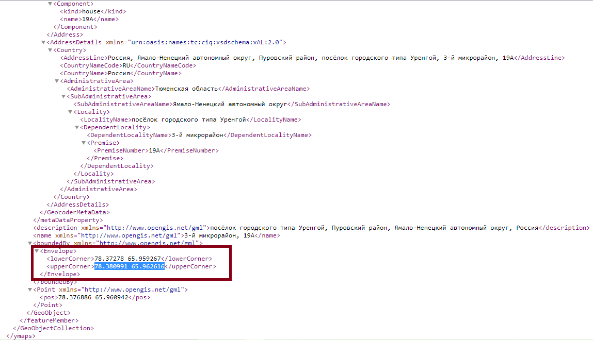

Ключевые слова: R[^1], r-project, RStudio  

Примеры выполнены R версии `r paste0(R.version$major, '.', R.version$minor)`, "`r R.version$nickname`".  

Версия RStudio: 1.4.1103.  

Все ссылки действительны на 8 апреля 2021 г.  

Файл с макетом кода для этой практики: [lab_2-6-2019_before.Rmd](https://github.com/aksyuk/DPV-R_Materials/tree/master/Labs/Lab-06)     


```{r setup, include = F}
knitr::opts_chunk$set(
    echo = T,
    comment = "#>",
    collapse = T
    # fig.align = 'center'
    # fig.height = 4,
    # fig.width = 4
)

# пакеты
# загрузка пакетов
library('data.table')
library('WDI')
library('leaflet')
# devtools::install_github('mages/googleVis')
library('googleVis')
library('RCurl')
library('httr')
library('jsonlite')
library('XML')

# Sys.setlocale('ru_RU')

# директории
if (!dir.exists('./plots')) {
    dir.create('./plots/')
}
if (!dir.exists('./data')) {
    dir.create('./data/')
}

# функция для форматирования чисел в тексте (2 знака после запятой)
comma <- function(x) {
    format(x, nsmall = 2, digits = 2, big.mark = ' ', decimal.mark = ',')
}

# функция для записи файла в UTF-8
# source: https://tomizonor.wordpress.com/2013/04/17/file-utf8-windows/
BOM <- charToRaw('\xEF\xBB\xBF')
writeUtf8 <- function(x, file, bom = F) {
  con <- file(file, "wb")
  if (bom) writeBin(BOM, con, endian = "little")
  writeBin(charToRaw(x), con, endian = "little")
  close(con)
}

# размеры графиков
png.width <- 400
png.height <- 400

```

##### Новая страница    

## Динамические карты в "googleVis" и "leaflet"         

\ \ \ \ \ **Пример №1**. На базе примера, данного в руководстве "Dynamic Graphics with the googleVis Package" [^2], построим несколько динамических карт и включим их в html-документ. Сделаем это средствами пакетов "googleVis" [^3] и "leaflet" [^4][^5].    

\ \ \ \ \ Нам понадобится скрипт на языке RMarkdown. Будем работать с шаблоном скрипта [`lab_2-6-2019_before.Rmd`](), который содержит заголовок и текст с пояснениями, остаётся дополнить блоки кода на языке R. Их в отчёте три:     

* **"Интерактивная картограмма"**, который строит карту мира и раскрашивает страны по ВВП на душу населения в текущих ценах (долл. США). Данные для картограммы подтянем из базы данных Всемирного банка с помощью пакета "WDI" [^6].    

* Блок **"Карта с маркерами на основе leaflet"** отмечает на карте расположение аптек в посёлке Уренгой (набор данных с Портала открытых данных РФ) [^7].    

* Блок **"Карта с радиусами на основе leaflet"** строит карту по данным схемы размещения источников твёрдых бытовых отходов в Ямало-Ненецком автономном округе с Портала открытых данных РФ. Координаты объектов определены по адресам при помощи API Геокодера Яндекс.   

\ \ \ \ \ Данные, которыми мы воспользуемся, можно скачать в R напрямую из соответствующих источников, и в случае статистики Всемирного банка мы так и сделаем. Но чтобы работать с Порталом открытых данных необходим индивидуальный ключ, поэтому для построения карт на базе "leaflet" мы воспользуемся копиями таблиц, размещёнными в репозитории на github.com. Загрузка данных с помощью API <https://data.gov.ru/>, а также работа с Геокодером от Яндекс описана в разделе "Подготовка данных".     

\ \ \ \ \ Функции отрисовки карт, которыми мы воспользуемся, возвращают результат в виде html-кода. Чтобы результаты корректно включились в текст отчёта, добавим блокам кода опцию `results = 'asis'`. Кроме того, для ускорения повторной загрузки карт, можно включать в блоки опцию `cache = T`.     

\ \ \ \ \ Ниже приводится код блоков файла `lab_2-6-2019.Rmd`. Получить отчёт в формате html можно, нажав на кнопку "Knit HTML" над окном редактора RStudio (Рис. 1).     
    
  

\ \ \ \ \ Загрузка пакетов происходит в блоке "setup":    

```{r paragraph-01-chunk-01-noneval, eval = F}
# загрузка пакетов
library('data.table')
library('WDI')
library('leaflet')
suppressPackageStartupMessages(library('googleVis'))

```


\ \ \ \ \ Блок **"Интерактивная картограмма"**:    

```{r paragraph-01-chunk-02-noneval, eval = F}
# данные по ВВП по ППП
indicator.code <- 'NY.GDP.PCAP.PP.CD'
DT <- data.table(WDI(indicator = indicator.code, start = 2017, end = 2017))

# все коды стран iso2
fileURL <- 'https://pkgstore.datahub.io/core/country-list/data_csv/data/d7c9d7cfb42cb69f4422dec222dbbaa8/data_csv.csv'
all.iso2.country.codes <- read.csv(fileURL, stringsAsFactors = F, 
                                   na.strings = '.')

# убираем макрорегионы
DT <- na.omit(DT[iso2c %in% all.iso2.country.codes$Code, ])

# объект: таблица исходных данных
g.tbl <- gvisTable(data = DT[, -'year'], 
                   options = list(width = 300, height = 400))
# объект: интерактивная карта
g.chart <- gvisGeoChart(data = DT, 
                        locationvar = 'iso2c', 
                        hovervar = 'country',
                        colorvar = indicator.code, 
                        options = list(width = 500, 
                                       height = 400, 
                                       dataMode = 'regions'))
# размещаем таблицу и карту на одной панели (слева направо)
TG <- gvisMerge(g.tbl, g.chart, 
                horizontal = TRUE, 
                tableOptions = 'bgcolor=\"#CCCCCC\" cellspacing=10')

# вставляем результат в html-документ
TG

```

\ \ \ \ \ Рассмотрим подробнее функции, которые мы использовали для построения графиков и таблиц. Функция `gvisTable()` позволяет добавить таблицу на веб-страницу. Мы использовали аргументы:     

* `data` -- объект с таблицей для отображения.     

* `options` -- список настроек отображения таблицы в виде "название опции" -- "значение". Среди настроек: `width` -- ширина таблицы, `height` -- высота таблицы.     

\ \ \ \ \ Функция `gvisGeoChart()` добавляет на страницу контурную карту стран мира, раскрашенную по значениям показателя. Некоторые аргументы:     

* `data` -- объект с таблицей данных для отображения. В нашем случае содержит столбец с именами стран (названия стран на английском языке, полный список можно найти, например, здесь: <http://www.nationsonline.org/oneworld/countries_of_the_world.htm>) и столбец значений показателя, используемого для заливки.     

* `locationvar` -- имя столбца таблицы данных с названиями регионов или точками для отображения на карте. Возможны два формата: "широта:долгота" или текстовый формат, который допускает адреса, названия стран, названия регионов или коды административных районов США. В нашем случае значение этого аргумента -- имя столбца таблицы данных, в котором записаны названия стран.     

* `colorvar` -- имя столбца таблицы данных со значениями показателя для заливки.     

* `options` -- список настроек отображения графика. Среди настроек: `width` -- ширина графика, `height` -- высота графика, `datamode` -- формат отображения локаций. В нашем случае принимает значение "regions", что соответствует заливке регионов.     

\ \ \ \ \ Функция `gvisMap()` добавляет на веб-страницу интерактивную карту от Google. Аргументы:     

\ \ \ \ \ Следует отметить, что возможности "googleVis" не ограничиваются одними картограммами, однако с лета 2018 года пользоваться большинством возможностей API карт от Google можно только за деньги. Примеры можно найти здесь: [cran.r-project.org/web/packages/googleVis/vignettes/googleVis_examples.html](cran.r-project.org/web/packages/googleVis/vignettes/googleVis_examples.html).

\ \ \ \ \ Блок **"Карта с маркерами на основе leaflet"**:    

```{r paragraph-01-chunk-03-noneval, eval = F}
# картинка-логотип для маркеров объекта
fileURL <- 'https://github.com/aksyuk/R-data/raw/master/pics/pharmacy-icon.png'
pharm.icon <- makeIcon(iconUrl = fileURL, 
                       iconWidth = 31,
                       iconHeight = 31,
                       iconAnchorX = 31,
                       iconAnchorY = 31)

fileURL <- 'https://raw.githubusercontent.com/aksyuk/R-data/master/examples/Urengoy_pharmacies.csv'

DT.loc <- read.csv2(fileURL, stringsAsFactors = F)
DT.loc$lat <- as.numeric(DT.loc$lat)
DT.loc$long <- as.numeric(DT.loc$long)

# подписи к объектам с гиперссылками
map.sites <- paste0(DT.loc$Наименование.объекта, '</br>',
                    DT.loc$Режим.работы, '</br>',
                    '<em>', DT.loc$Контактный.телефон, '</em>')

# создаём виджет с картой
myMap <- DT.loc %>% leaflet(width = 800, height = 800) %>% 
addTiles() %>% addMarkers(icon = pharm.icon, popup = map.sites)

# рисуем карту
myMap

```

\ \ \ \ \ При построении второй карты мы воспользовались функциями пакета "leaflet":     

1. `leaflet()` -- строит виджет с картой, используя пакет «htmlwidgets» (<http://www.htmlwidgets.org/>), который позволяет создавать виджеты на Java Script, пользуясь только кодом на R.     

1. `addTiles()` -- добавляет слои на карту, созданную функцией `leaflet()`. Без аргументов добавляет карту мира из базы openstreetmap.     

1. `addMarkers()` -- добавляет на карту маркеры. Мы использовали аргументы:     

  * `icon` -- символ маркера, созданный функцией `makeIcon()` из графического файла;     
  
  * `popup` -- вектор с текстом сообщений, всплывающих при наведении мыши на маркер на карте. Текст может включать html-разметку (ссылки, выделение текста, перенос на новую строку).     
  
\ \ \ \ \ Эти функции мы соединяли с данными посредством пайплайнов, которые передают результат выражения слева от оператора `%>%` на вход функции справа.     

\ \ \ \ \ Блок **"Карта с радиусами на основе leaflet"**:    

```{r paragraph-01-chunk-04-noneval, eval = F}
fileURL <- 'https://raw.githubusercontent.com/aksyuk/R-data/master/examples/YNao_tbo.csv'

DT.rad <- read.csv2(fileURL, stringsAsFactors = F, na.strings = '-')
DT.rad <- na.omit(DT.rad)

popups <- paste0('<b>', DT.rad$Наименование.источника.образования.отходов,
                 '</b></br>', DT.rad$Численность.населения.МО.на.01.01.2016.г.,
                 ' чел.')

DT.rad %>%
leaflet() %>%
addTiles() %>%
addMarkers(popup = popups,
           clusterOptions = markerClusterOptions()) %>% 
addCircles(weight = 1, radius = sqrt(DT.rad$Численность.населения.МО.на.01.01.2016.г.) * 100)

```

\ \ \ \ \ Радиусы на третью карту добавлены функцией `addCircles()`. Радиусы рассчитываются по формуле $\sqrt{Численность.населения.МО.на.01.01.2016.г. * 100}$, которая была подобрана эмпирически. Размер радиусов можно увеличивать или уменьшать в зависимости от масштаба отображения карты с помощью логарифмирования, извлечения корня, домножения на константу, однако они остаются пропорциональны показателю численности населения.     

\ \ \ \ \ В конце файла с примерами карт, под заголовком "Использованы пакеты R", процитированы пакеты, с помощью которых мы работали с данными и генерировали карты. Чтобы получить ссылку для цитирования любого пакета в R достаточно воспользоваться функцией `citation()`. Результат включает библиографическую ссылку в текстовом формате и в формате LaTeX.     

```{r paragraph-01-chunk-05}
citation('data.table')$textVersion
citation('WDI')$textVersion
citation('leaflet')$textVersion
citation('googleVis')$textVersion

```

\ \ \ \ \ Готовый отчёт опубликован на RPubs по адресу: <http://rpubs.com/aksyuk/lab_2-6-2019>.      

\ \ \ \ \ Если интерактивные карты не отображаются во встроенном браузере R, нужно открыть файл html-отчёта в системном браузере, например, в Mozilla Firefox. Файл отчёта имеет то же имя, что и скрипт Rmd, и расширение `.html`. Он появляется в рабочей директории после того, как скрипт `.Rmd` "связан" с помощью пакета "knitR". В нашем примере это файл `lab_2-6-2019_before.html`.     

\ \ \ \ \ Если при загрузке на RPubs половина карт не отображается, нужно убедиться, что в YAML-заголовке документа стоит опция `self_contained: yes` (см. Рис.1). При возникновении ошибки 67 при генерации отчёта нужно загрузить последнюю версию pandoc из репозитория <https://github.com/pandoc-extras/pandoc-nightly/releases/tag/hash-7c20fab3> и распаковать его в директорию `<путь_к_RStudio>\RStudio\bin\pandoc`.    


## Подготовка данных      

### API базы данных Всемирного банка: пакет "WDI"    

\ \ \ \ \ В пакете "WDI" реализован API для базы данных Всемирного банка <http://data.worldbank.org/indicator>. Пример кода загрузки значений показателя «Agricultural irrigated land (% of total agricultural land)» (процент ирригируемых земель в общей площади сельхозяйственных земель) по всем странам за 2013 год:    

```{r paragraph-02-chunk-01}
# загрузка пакета
library('WDI')

# загрузка данных по всем странам, 2013 год, показатель
#  Agricultural irrigated land (% of total agricultural land)
dat <-  WDI(indicator = 'SP.RUR.TOTL.ZS', start = 2013, end = 2013)

```

\ \ \ \ \ Код показателя показан в URL веб-страницы со статистикой (Рис. 2).

  

### API Портала открытых данных РФ    

\ \ \ \ \ Портал [data.gov.ru](data.gov.ru) содержит более 20000 наборов данных. Пример работы с его API описан в книге Д.Храмова "Сбор данных в Интернете на языке R" [^8]. Для начала необходимо зарегистрироваться на портале. Для этого зайдите в раздел "Сервисы" --> "Разработчикам" --> "API" и нажать кнопку "Получить ключ API" (Рис.3 -- Рис.5).     

  

  

  

\ \ \ \ \ После регистрации ключ API будет доступен в профиле пользователя (Рис.6).     

  

\ \ \ \ \ На странице <https://data.gov.ru/pravila-i-rekomendacii> описаны текущие возможности API портала. Для работы с ним нам понадобятся пакеты:     

```{r paragraph-02-chunk-02}
library('httr')
library('jsonlite')

```

Сохраним базовый URL, к которому будут присоединяться адреса для извлечения данных, и ключ API в переменные:    

```{r paragraph-02-chunk-03-hidden, include = F}
URL.base <- 'http://data.gov.ru/api/'
API.key <- '1a0839965691699130c22156689e07f3' 

```

```{r paragraph-02-chunk-03, eval = F}
URL.base <- 'http://data.gov.ru/api/'
API.key <- 'замените_на_свой_ключ_API_data.gov.ru'

```

\ \ \ \ \ Чтобы загрузить набор данных, нужно сформировать URL для доступа и загрузить его с помощью функции `getURL()`. Результат вернётся в формате JSON. Объединим эти действия внутри функции, описанной в [^8].    

```{r paragraph-02-chunk-04-hidden, include = F}
getOpenDataRF <- function(api.params, url.base = URL.base, api.key = API.key) {
    par <- paste0(api.params, collapse = '/')
    url <- paste0(url.base, par, '/?access_token=', api.key)
    message(paste0('Загружаем', gsub(API.key, 'замените_на_свой_ключ_API_data.gov.ru',
                                         url), ' ...'))
    resp <- GET(url)
    fromJSON(content(resp, 'text'))
}

```

```{r paragraph-02-chunk-04, eval = F}
getOpenDataRF <- function(api.params, url.base = URL.base, api.key = API.key) {
    par <- paste0(api.params, collapse = '/')
    url <- paste0(url.base, par, '/?access_token=', api.key)
    message(paste0('Загружаем ', url, ' ...'))
    resp <- GET(url)
    fromJSON(content(resp, 'text'))
}

```

\ \ \ \ \ Теперь можно загрузить таблицу с именами и идентификаторами всех наборов данных.    

```{r paragraph-02-chunk-05-1}
# загрузка таблицы-индекса с именами и id всех наборов данных
params <- c('dataset')
datasets <- getOpenDataRF(params)

# общее количество наборов и структура таблицы-индекса
nrow(datasets)
str(datasets)

# количество наборов данных по тематике
table(datasets$topic)

# несколько таблиц из начала таблицы-индекса
head(datasets[, c('title', 'identifier')])

```

\ \ \ \ \ Важно также уметь искать таблицы по части названия. С помощью функции `grepl()` отфильтруем только те таблицы, которые касаются Костромы и Костромской области; будем искать в столбце `title` таблицы `datasets` последовательность символов "Костром" (регистр важен).     

```{r paragraph-02-chunk-05-2}
# найдём таблицы с именами, которые содержат "Костром"    
doc <- datasets[grep('Костром', datasets$title), c('identifier', 'topic',
                                                   'title')]
# прежде чем выводить в отчёт, уберём лишние пробелы
doc$title <- gsub('^[ ]*', '', doc$title)
doc

```

\ \ \ \ \ Некоторые таблицы уже содержат координаты, но формат их представления требует предварительной обработки. Загрузим таблицу по центрам образования ТБО Ямало-Ненецкого автономного округа, которую использовали для построения последней карты. Её идентификатор `8901017727-shematbo`.        

```{r paragraph-02-chunk-06}
dataset_id <- '8901017727-shematbo'
params <- c('dataset', dataset_id, 'version')
versions <- getOpenDataRF(params)
params <- c(params, versions[nrow(versions), 1], 'content')
dataset <- getOpenDataRF(params)
head(dataset)

```

\ \ \ \ \ Преобразуем столбцы широты и долготы (`lat` и `long` соответственно) и переведём их в числовой формат. В данном случае координаты даны в формате `a°b'c''`, т.е. `a` градусов `b` минут `c` секунд, поэтому воспользуемся формулой пересчёта в градусы $a + b / 60 + c / 3600$.     

```{r paragraph-02-chunk-07}
# пересчёт широты
lat <- dataset$`Географические координаты`
lat <- as.numeric(gsub(pattern = "([0-9]{2})°.*", replacement = "\\1", lat)) + 
    as.numeric(gsub(pattern = "[0-9]{2}°([0-9]{2})[\\].*", 
                    replacement = "\\1", lat)) / 60 + 
    as.numeric(gsub(pattern = "[0-9]{2}°[0-9]{2}[\\]'([0-9]{2})[\\].*", 
                    replacement = "\\1", lat)) / 3600

# пересчёт долготы
long <- dataset$`Географические координаты`
long <- as.numeric(gsub(pattern = ".+([0-9]{2})°.*", replacement = "\\1", long)) + 
    as.numeric(gsub(pattern = ".+[0-9]{2}°([0-9]{2})[\\].*", 
                    replacement = "\\1", long)) / 60 + 
    as.numeric(gsub(pattern = ".+[0-9]{2}°[0-9]{2}[\\]'([0-9]{2})[\\].*", 
                    replacement = "\\1", long)) / 3600

# перезаписываем столбцы
dataset$long <- long
dataset$lat <- lat
dataset$`Географические координаты` <- NULL

# сохраняем таблицу в csv
write.csv2(dataset, file = "./data/YNao_tbo.csv", row.names = F)

```

\ \ \ \ \ Теперь загрузим список аптек поселка Уренгой, по которому рисовали вторую карту. Идентификатор этой таблицы `8911021426-aptekalist`.      

```{r paragraph-02-chunk-08}
# загрузка списка аптек посёлка Уренгой
dataset_id <- '8911021426-aptekalist'
params <- c('dataset', dataset_id)
dataset <- getOpenDataRF(params)

# количество версий таблицы
params <- c(params, 'version')
versions <- getOpenDataRF(params)
nrow(versions)

# загружаем последнюю версию с объект doc
mrv <- versions[nrow(versions), 1]
params <- c(params, mrv)
content <- c(params, 'content')
doc <- getOpenDataRF(content)
head(doc)

```

\ \ \ \ \ Проблема в том, что в файле отсутствуют координаты, есть только адреса аптек. Перевести адреса в координаты нам поможет API Геокодера от Яндекса.    


### API Геокодера Яндекс       

\ \ \ \ \ Яндекс предоставляет бесплатный доступ к API карт (<https://tech.yandex.ru/maps/mapsapi/>) с ограничениями: до 25 000 запросов в сутки. Документация доступна по адресу: <https://tech.yandex.ru/maps/doc/geocoder/desc/concepts/input_params-docpage/>.      

\ \ \ \ \ Чтобы пользоваться API, необходимо зарегистрироваться (достаточно почтового ящика на яндекс почте). На странице <https://developer.tech.yandex.ru/services> нужно подключить "JavaScript API и HTTP Геокодер" (Рис.7).    

  

\ \ \ \ \ Сохраним ключ API и базовый URL.     

```{r paragraph-02-chunk-09-hidden, include = F}
URL.base <- 'https://geocode-maps.yandex.ru/1.x/'
API.key <- '4805f844-8782-4568-b6ee-3b476bd3be07'    

```

```{r paragraph-02-chunk-09, eval = F}
URL.base <- 'https://geocode-maps.yandex.ru/1.x/'
API.key <- 'замените_на_свой_ключ_API_Яндекс_карт'

```

\ \ \ \ \ Создадим функцию `getYandexMaps()`, которая присоединяет к базовому API ключ пользователя (`?access_token=`) и другие параметры из аргумента `api.params`. Имена параметров должны начинаться с символа `'&'`. Результат возвращается в виде XML-страницы со своим собственным пространством имён, поэтому для его разбора в функции `xpathSApply()` используется конструкция `[local-name()=<имя_искомого_тега>]`. Пример XML-файла для первого адреса (`r doc$Адрес[1]`) показан на Рис.8.     

```{r paragraph-02-chunk-10-hidden, include = F}
getYandexMaps <- function(api.params, url.base = URL.base, api.key = API.key) {
    par <- paste0(api.params, collapse = '&')
    url <- paste0(url.base, '?format=xml&apikey=', api.key, par)

    message(paste0('Загружаем ', gsub(api.key, 'замените_на_свой_ключ_API_Яндекс_карт',
                                      url), ' ...'))
    
    doc.ya <- content(GET(url), 'text', encoding = "UTF-8")
    
    rootNode <- xmlRoot(xmlTreeParse(doc.ya, useInternalNodes = T))
    coords <- xpathSApply(rootNode, "//*[name()='Envelope']/*", xmlValue)
    coords <- lapply(strsplit(coords, ' '), as.numeric)
    coords <- unlist(lapply(coords, mean))
    names(coords) <- c('lat', 'long')
    coords
}

```

```{r paragraph-02-chunk-10, eval = F}
library('XML')

getYandexMaps <- function(api.params, url.base = URL.base, api.key = API.key) {
    par <- paste0(api.params, collapse = '&')
    url <- paste0(url.base, '?format=xml&apikey=', api.key, par)

    message(paste0('Загружаем ', url, ' ...'))
    
    doc.ya <- content(GET(url), 'text', encoding = "UTF-8")
    
    rootNode <- xmlRoot(xmlTreeParse(doc.ya, useInternalNodes = T))
    coords <- xpathSApply(rootNode, "//*[name()='Envelope']/*", xmlValue)
    coords <- lapply(strsplit(coords, ' '), as.numeric)
    coords <- unlist(lapply(coords, mean))
    names(coords) <- c('lat', 'long')
    coords
}

```


  

\ \ \ \ \ Загрузим координаты аптек по адресам. Адрес необходимо добавить к базовому URL сразу после параметра `&geocode=`, причём все пробелы в адресе нужно заменить на символы `'+'`. Чтобы избежать проблем с преобразованием кириллицы, закодируем их вручную в UTF функцией `curlEscape()`[^9].       

```{r paragraph-02-chunk-11}
# координаты первой аптеки
params <- paste0('&geocode=', gsub(pattern = ' ', replacement = '+', curlEscape(doc$Адрес[1])))
getYandexMaps(params)

# грузим координаты сразу по всем адресам из столбца Адрес таблицы doc
coords <- sapply(as.list(doc$Адрес), function(x) {
    params <- paste0('&geocode=', gsub(curlEscape(x), pattern = ' ', 
                                       replacement = '+'))
    getYandexMaps(params)
    })

# преобразуем во фрейм
df.coords <- as.data.frame(t(coords))
colnames(df.coords) <- c('long', 'lat')

# присоединяем к таблице с адресами и сохраняем в csv
doc <- cbind(doc, df.coords)

write.csv2(doc, file = "./data/Urengoy_pharmacies.csv", row.names = F)

```


## Упражнения   

### Упражнение 5   

\ \ \ \ \ Создать .Rmd скрипт, который генерирует html-отчёт с двумя картами:     

1. Картограмма с таблицей стран мира по показателю из базы Всемирного банка (интерактивная картограмма из примера).     

2. Карта с маркерами или с радиусами, построенная по набору данных с Портала открытых данных РФ.     

\ \ \ \ \ Данные для карт можно загружать из своего репозитория на github.com. Код загрузки данных с помощью API предоставлять необязательно, но если выкладываете его на github.com, не забудьте заново сгенерировать ключи API, чтобы никто не мог воспользоваться вашим логином.    

\ \ \ \ \ Распределение баллов за упражнение:    

* есть первая карта: 4 балла;     

* есть вторая карта (метки на карте содержат всплывающие подсказки с информацией об объектах): 4 балла;     

* html-страница с картами содержит дату создания документа и размещена на RPubs или github.io: 3 балла.     

\ \ \ \ \ Чтобы разместить на github отображаемую веб-страницу, необходимо создать репозиторий имя_пользователя.gothub.io (где имя_пользователя – ваш логин на github) и разместить в нём html-документ для отображения. Страница будет доступна по адресу https://имя_пользователя.github.io. Подробнее: <https://pages.github.com/>.


**Варианты**:     

1. WDI: любой показатель из раздела "Agriculture & Rural Development" (Сельское хозяйство и развитие сельских районов). Портал открытых данных: Ветеринарные учреждения муниципального образования город Ноябрьск (id: `8905001855-vetychregdeniy`)    

1. WDI: любой показатель из раздела "Aid Effectiveness" (Эффективность госпомощи). Портал открытых данных: Портал открытых данных: Объекты культурного наследия на территории Костромской области (id: `4401168294-oknkosobl`), *взять только расположенные в посёлке Вохма*     

1. WDI: любой показатель из раздела "Climate Change" (Изменение климата). Портал открытых данных: Портал открытых данных: Объекты культурного наследия на территории Костромской области (id: `4401168294-oknkosobl`), *взять только расположенные в городе Галич*     

1. WDI: любой показатель из раздела "Economy & Growth" (Экономика и рост). Портал открытых данных: Портал открытых данных: Объекты культурного наследия на территории Костромской области (id: `4401168294-oknkosobl`), *взять только расположенные в городе Буй*      

1. WDI: любой показатель из раздела "Education" (Образование). Портал открытых данных: Объекты культурного наследия на территории Костромской области (id: `4401168294-oknkosobl`), *взять только расположенные в городе Кострома*      

1. WDI: любой показатель из раздела "Energy & Mining" (Энергетика и добывающие отрасли). Портал открытых данных: Адресный перечень многоквартирных домов, вошедших в региональную программу Капитальный ремонт общего имущества в многоквартирных домах, расположенных на территории Волгоградской области (id: `3460012716-zhkhregistryoverhaul`), *взять только расположенные в городе Калач-на-Дону*      

1. WDI: любой показатель из раздела "Environment" (Окружающая среда). Портал открытых данных: Адресный перечень многоквартирных домов, вошедших в региональную программу Капитальный ремонт общего имущества в многоквартирных домах, расположенных на территории Волгоградской области (id: `3460012716-zhkhregistryoverhaul`), *взять только расположенные в городе Суровикино*      

1. WDI: любой показатель из раздела "External Debt" (Внешний долг). Портал открытых данных: Адресный перечень многоквартирных домов, вошедших в региональную программу Капитальный ремонт общего имущества в многоквартирных домах, расположенных на территории Волгоградской области (id: `3460012716-zhkhregistryoverhaul`), *взять только расположенные в городе Жирновск*    

1. WDI: любой показатель из раздела "Financial Sector" (Финансовый сектор). Портал открытых данных: Адресный перечень многоквартирных домов, вошедших в региональную программу Капитальный ремонт общего имущества в многоквартирных домах, расположенных на территории Волгоградской области (id: `3460012716-zhkhregistryoverhaul`), *взять только расположенные в городе Ленинск*    

1. WDI: любой показатель из раздела "Gender" (Гендерное неравенство). Портал открытых данных: Сведения о местах нахождения многоквартирных жилых домов, в которых осуществлен капитальный ремонт, по Краснодарскому краю (id: `2308078236-18dom`), *взять только расположенные в городе Анапа*      

1. WDI: любой показатель из раздела "Health" (Здоровье). Портал открытых данных: Сведения о местах нахождения многоквартирных жилых домов, в которых осуществлен капитальный ремонт, по Краснодарскому краю (id: `2308078236-18dom`), *взять только расположенные в городе Краснодар*      

1. WDI: любой показатель из раздела "Infrastructure" (Инфраструктура). Портал открытых данных: Сведения о местах нахождения многоквартирных жилых домов, в которых осуществлен капитальный ремонт, по Краснодарскому краю (id: `2308078236-18dom`), *взять только расположенные в городе Белореченск*      

1. WDI: любой показатель из раздела "Poverty" (Бедность). Портал открытых данных: Сведения о местах нахождения администраций муниципальных образований Амурской области (id: `2818002442-adresaadministraciy`)        

1. WDI: любой показатель из раздела "Private Sector" (Частный сектор). Портал открытых данных: Перечень спортивных учреждений, расположенных на территории поселка Пурпе (id: `8911021440-sport`)

1. WDI: любой показатель из раздела "Public Sector" (Государственный сектор). Портал открытых данных: Адреса расположения экобоксов по сбору батареек на территории поселка Пурпе (id: `8911021440-utilizacija`)   

1. WDI: любой показатель из раздела "Science & Technology" (Наука и технологии). Портал открытых данных: Перечень медицинских учреждений, расположенных на территории поселка Пурпе (id: `8911021440-zdorovje`)   

1. WDI: любой показатель из раздела "Social Development" (Социальное развития). Портал открытых данных: Перечень библиотек, расположенных на территории поселка Пурпе (id: `8911021440-biblioteki`)   

1. WDI: любой показатель из раздела "Social Protection & Labor" (Социальная защита и труд). Портал открытых данных: Перечень учреждений дошкольного образования, расположенных на территории поселка Пурпе (id: `8911021440-obrazovanie`)      

[//]: # Концевые сноски

[^1]: R Core Team (2015). R: A language and environment for statistical computing. R Foundation for Statistical Computing, Vienna, Austria. URL <https://www.R-project.org/>   

[^2]: Dynamic Graphics with the googleVis Package <http://rpubs.com/gallery/googleVis>     

[^3]: Markus Gesmann and Diego de Castillo. Using the Google Visualisation API with R. The R Journal, 3(2):40-44, December 2011    

[^4]: Joe Cheng, Bhaskar Karambelkar and Yihui Xie (2018). leaflet: Create Interactive Web Maps with the JavaScript 'Leaflet' Library. R package version 2.0.2. <https://CRAN.R-project.org/package=leaflet>    

[^5]: Leaflet for R <https://rstudio.github.io/leaflet/>    

[^6]: Vincent Arel-Bundock (2019). WDI: World Development Indicators (World Bank). R package version 2.6.0. <https://CRAN.R-project.org/package=WDI>    

[^7]: Портал открытых данных РФ <https://data.gov.ru/>    

[^8]: Дмитрий Храмов, «Сбор данных в Интернете на языке R». – М.: ДМК Пресс, 2017. – 280 с.    

[^9]: Дмитрий Храмов, «R и кириллица в URL» / dkhramov.dp.ua. URL: <http://dkhramov.dp.ua/Comp.RCyrillicURLEncoding#.YG8cVOgzbIU>    
